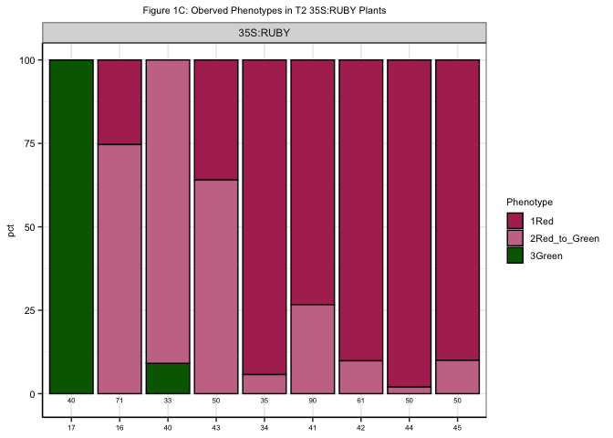
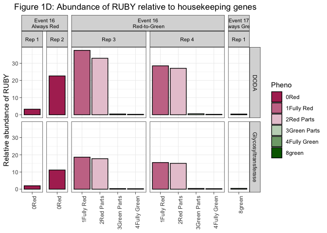
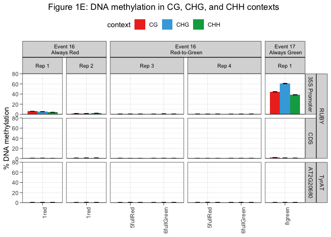

Figure_1
================

This is an [R Markdown](http://rmarkdown.rstudio.com) Notebook. When you
execute code within the notebook, the results appear beneath the code.

Try executing this chunk by clicking the *Run* button within the chunk
or by placing your cursor inside it and pressing *Cmd+Shift+Enter*.

``` r
library(tidyverse)
```

    ## ── Attaching core tidyverse packages ──────────────────────── tidyverse 2.0.0 ──
    ## ✔ dplyr     1.1.4     ✔ readr     2.1.5
    ## ✔ forcats   1.0.0     ✔ stringr   1.5.1
    ## ✔ ggplot2   3.5.1     ✔ tibble    3.2.1
    ## ✔ lubridate 1.9.3     ✔ tidyr     1.3.1
    ## ✔ purrr     1.0.2     
    ## ── Conflicts ────────────────────────────────────────── tidyverse_conflicts() ──
    ## ✖ dplyr::filter() masks stats::filter()
    ## ✖ dplyr::lag()    masks stats::lag()
    ## ℹ Use the conflicted package (<http://conflicted.r-lib.org/>) to force all conflicts to become errors

``` r
library(ggpubr)
library("readxl")
library(patchwork)
library(ggh4x)
```

    ## 
    ## Attaching package: 'ggh4x'
    ## 
    ## The following object is masked from 'package:ggplot2':
    ## 
    ##     guide_axis_logticks

``` r
## Figure 1C - phenotyping
## Read in files containing the phenotyping data information
inT2 <- read.table("/Users/mariannekramer/Google Drive/Kramer_et_al_AIO/Figures/ruby_phenotypes/T2_plant_phenotyping.txt",header=T,sep="\t") 
inT2.2 <- read.table("/Users/mariannekramer/Google Drive/Kramer_et_al_AIO/Figures/ruby_phenotypes/T2_plant_phenotyping.notebook.txt",header=T,sep="\t") 

## Define themes for visual preferences
themes <- theme(legend.position = "right",
                axis.ticks.length=unit(0.0516,"in"),
                plot.title=element_text(hjust=0.5, color = 'black', size = 8),
                axis.title.x= element_blank(),
                axis.text.x=element_text(color = 'black',size = 6),
                axis.line.x=element_line(color = 'black'),
                axis.text.y= element_text(color = 'black',size = 8),
                axis.line.y=element_line(color = 'black'),
                axis.title.y= element_text(color = 'black',size = 8),
                panel.background = element_blank(),
                legend.text=element_text(color = 'black',size = 8),
                legend.key.size= unit(0.5,"cm"),
                legend.title = element_text(color = 'black',size = 8))

## Define colors for phenotypes
phenoColors <- c("#B03060","#C97795","#E8C8D4","#C2D5C0","#7FA779","#006400")

## T2
## Combine independent experiments, count how many plants are in each Event (Genotype) and phenotype, filter out unused data
phenoT2.2 <- inT2 %>% select(Genotype,Phenotype) %>% rbind(inT2.2) %>% group_by(Genotype,Phenotype) %>% 
  dplyr::summarize(count=n()) %>% group_by(Genotype) %>%
  dplyr::mutate(sum=sum(count),pct=count/sum*100,
                Phenotype=case_when(Phenotype=="Red"~ "1Red",
                                    Phenotype=="Red_to_Green"~"2Red_to_Green",
                                    Phenotype=="Green"~"3Green"),
                Tg = case_when(Genotype == "MK048" ~ "UBQ:RUBY",grepl("MK05",Genotype)~"UBQ:RUBY",TRUE~"35S:RUBY")) %>%
  dplyr::filter(Genotype != "MK016") %>% dplyr::filter(Tg == "35S:RUBY") %>% 
  dplyr::mutate(Genotype = case_when(Genotype == "MK063" ~ "MK016", TRUE ~ Genotype)) %>% 
  dplyr::mutate(Genotype = str_replace(Genotype,"MK0",""))
```

    ## `summarise()` has grouped output by 'Genotype'. You can override using the
    ## `.groups` argument.

``` r
## Get file for labeling plot with N
plotTxt2.2 <- phenoT2.2 %>% select(Genotype,sum,Tg) %>% distinct

## Plot
ggplot(phenoT2.2, aes(x=factor(Genotype,levels = c("17","16","40","43","34","41","42","44","45")),y=pct, fill=Phenotype)) + geom_col(color='black') + 
  scale_fill_manual(values=c("#B03060","#C97795","#006400")) + facet_grid(~Tg,scale='free',space='free')+
  theme_bw() + themes+
  geom_text(data=plotTxt2.2,aes(label=sum,y=-2,x=as.factor(Genotype)),inherit.aes = F,size=2) + 
  ggtitle("Figure 1C: Oberved Phenotypes in T2 35S:RUBY Plants")
```

<!-- -->

``` r
## Figure 1D - RUBY qPCR
### qPCR Analysis for RUBY qPCR
## Read in files of qPCR output for RUBY samples
plate1_rnd1 <- read_excel("/Users/mariannekramer/Google Drive/Kramer_et_al_AIO/Figures/ruby_qpcr/220623_ruby_target_capture_valid_plate1.xlsx",sheet="Results",range="D52:O315",col_names =c("Sample","Target","task","reporter","quencher","quantity","quant mean","quant sd","rq","rq min","rq max","CT"))
plate2_rnd1 <- read_excel("/Users/mariannekramer/Google Drive/Kramer_et_al_AIO/Figures/ruby_qpcr/220623_ruby_target_capture_valid_plate2.xlsx",sheet="Results",range="D52:O63",col_names =c("Sample","Target","task","reporter","quencher","quantity","quant mean","quant sd","rq","rq min","rq max","CT"))

## Define themes for visual preferences
themes <- theme(plot.title = element_text(hjust = 0.5),
                axis.text.x = element_text(angle = 90, vjust = 1, hjust=1),
                axis.title.x = element_blank(),
                line = element_line(color = 'black',linewidth=0.3,lineend="round"),
                axis.title.y = element_text(color = "black"),
                axis.title.y.right = element_text(color = "black"),
                strip.text.x = element_text(color = "black",size=8),
                legend.position = 'right')

## Filter out water samples, replace "Undetermined" with NA
plate1_rnd1 <- plate1_rnd1 %>%
  select(c(Sample,Target,CT)) %>% dplyr::filter(Sample != 'NA'& Sample != "water") %>%
   dplyr::mutate(CT = as.numeric(na_if(CT,"Undetermined")))

plate2_rnd1 <- plate2_rnd1 %>%
  select(c(Sample,Target,CT)) %>% dplyr::filter(Sample != 'NA' & Sample != "water") %>%
  dplyr::mutate(CT = as.numeric(CT))

#Merge independent experiments
data_rnd1 <- bind_rows(plate1_rnd1,plate2_rnd1)

## Visually check if any amplification in water
#plate1 %>% dplyr::filter(`Sample Name` == "water")

## Calculate the average CT for housekeeping genes for downstream normalization
ctrl_genes_rnd1 <- data_rnd1 %>% 
  dplyr::filter(Target == "AT1G08200" | Target == "UBC10") %>%
  group_by(Sample) %>%
  dplyr::summarize(avg_ctrl_CT = mean(CT))
  
## calculate dCT by dividing Ct by average of housekeeping genes, transform to RQ
analysis_rnd1 <- data_rnd1 %>% 
  right_join(ctrl_genes_rnd1, by = c("Sample")) %>%
  dplyr::mutate(dCt = CT-avg_ctrl_CT) %>%
  dplyr::mutate(RQ = 2**(-dCt))

## Format and filter data for plotting
toPlot_rnd1 <- analysis_rnd1 %>%
  dplyr::filter(Target != "AT1G08200" & Target != "UBC10") %>% 
  dplyr::mutate(Sample = case_when(Sample == "02_MK017_Green_Rep1" ~ "02_MK017_8green_Rep1", TRUE ~ Sample)) %>%
  dplyr::arrange(Sample) %>% separate(Sample, into = c("Number","Genotype","Pheno","Rep"), sep="_") %>%
  tidyr::unite(c("Genotype","Rep"), col="Sample",sep = "_") %>%
  group_by(Number,Sample,Pheno,Target) %>%
  dplyr::summarize(RQ=mean(RQ)) %>% 
  dplyr::mutate(Pheno = case_when(Pheno == "Red" ~ "0Red",
                                  Pheno == "FullRed" ~"1Fully Red",
                                  Pheno == "RedParts" ~"2Red Parts",
                                  Pheno == "FullGreen" ~"4Fully Green",
                                  Pheno == "GreenParts" ~"3Green Parts",
                                  TRUE ~ Pheno)) %>%
  dplyr::filter(Sample != "MK001_Rep1" & !grepl("MK034",Sample)& !grepl("MK010",Sample)& !grepl("MK040",Sample)) %>% 
  separate(Sample,into=c("geno","rep")) %>% 
  dplyr::mutate(rep = str_replace(rep,"Rep","Rep "),
         geno = case_when(geno == "MK016" ~ "Event 16",geno == "MK017" ~ "Event 17\n Always Green"), 
         sample = case_when((geno == "Event 16" & Pheno == "0Red") ~ "Event 16\n Always Red", 
                            (geno == "Event 16" & Pheno != "0Red") ~ "Event 16\n Red-to-Green", TRUE ~ geno))
```

    ## `summarise()` has grouped output by 'Number', 'Sample', 'Pheno'. You can
    ## override using the `.groups` argument.

``` r
## Plot
ggplot(toPlot_rnd1,aes(x=Pheno,y=RQ,fill=Pheno)) + geom_bar(stat="identity",position=position_dodge(0.9),color='black')+
  theme_bw() + themes + facet_nested(Target~sample+rep,scales="free_x",space="free") + 
  scale_fill_manual(values=c("#B03060","#C97795","#E8C8D4","#C2D5C0","#7FA779","#006400")) + 
  ylab("Relative abundance of RUBY") +
  ggtitle("Figure 1D: Abundance of RUBY relative to housekeeping genes")
```

<!-- -->

``` r
## Figure 1E - DNA methylation
## Read in data file
data <- read.table(file = "/Users/mariannekramer/Google Drive/Kramer_et_al_AIO/Figures/ruby_bsas/output_matrix.txt",
                   header = TRUE,
                   sep = "\t")
## Calculate percentage of cytosines that are methylated
data$totalC <- data$reads
data$Per <- data$percentage * 100
data <- dplyr::mutate(data, Per=ifelse(Per == 100.0, 50, Per))

## Calculate confidence intervals
data$plus <- ((((data$Per/100)+((1/(2*data$totalC)*(1.96^2))))+
                 (1.96*(sqrt(((data$Per/100)*(1-(data$Per/100))/data$totalC)+
                               ((1.96^2)/(4*data$totalC*data$totalC)))))))*100/1+((1/data$totalC)*(1.96^2))-data$Per
data$minus <- data$Per-((((data$Per/100)+((1/(2*data$totalC)*(1.96^2))))-
                  (1.96*(sqrt(((data$Per/100)*(1-(data$Per/100))/data$totalC)+
                                ((1.96^2)/(4*data$totalC*data$totalC)))))))*100/1+((1/data$totalC)*(1.96^2))
data <- dplyr::mutate(data, Per=ifelse(strand == "minus", -Per, Per))
data <- data[which(data$strand=='plus'),]

## Define themes for visual preferences
themes <- theme(plot.title = element_text(hjust = 0.5),
                axis.text.x = element_text(angle = 90, vjust = 1, hjust=1),
                axis.title.x = element_blank(),
                line = element_line(color = 'black',linewidth=0.3,lineend="round"),
                axis.title.y = element_text(color = "black"),
                axis.title.y.right = element_text(color = "black"),
                strip.text.x = element_text(color = "black",size=8),
                legend.position = 'top',
                axis.ticks.length=unit(0.0516,"in"))

## input file with sample information
sampleInfo <- read.table("/Users/mariannekramer/Google Drive/Kramer_et_al_AIO/Figures/ruby_bsas/MCK_to_sampleInfo.txt",sep="\t",header=T)

## Rename samples in data df, format
toPlot.bsas <- data %>% separate(col=amplicon, sep = "MCK",into=c("amplicon", "sampleNum")) %>% 
  dplyr::mutate(sampleNum = as.integer(sampleNum),
         target = case_when(grepl("RUBY",amplicon) ~ "RUBY", TRUE ~ "TyrAT"),
         amplicon = case_when(amplicon == "RUBY_A_" ~ "35S Promoter",
                              amplicon == "RUBY_B_"~"CDS",
                              amplicon == "TyrAT_"~"AT2G20680", TRUE ~ amplicon)) %>% 
  left_join(sampleInfo,by="sampleNum") %>% separate(info, into=c("geno","prom","pheno"),sep="[.]") %>% 
  separate(geno,into=c("event","rep"),sep="_") %>%
  dplyr::mutate(rep = str_replace(rep,"rep","Rep "),
         geno = case_when(event == "MK016" ~ "Event 16",
                          event == "MK017" ~ "Event 17"), 
         sample = case_when(event == "MK017" ~ "Event 17\n Always Green",
                            (event == "MK016" & pheno == "1red") ~ "Event 16\n Always Red", 
                            (event == "MK016" & pheno != "1red") ~ "Event 16\n Red-to-Green", TRUE ~ geno)) %>%
  dplyr::filter(geno != "MK034" & geno != "MK040")


ggplot(toPlot.bsas, aes(fill=context, y=Per, x=pheno)) + 
  geom_bar(position=position_dodge(), stat="identity") +
  geom_errorbar(aes(ymin=Per-minus, ymax=Per+plus), width=0.4, position = position_dodge(0.9)) +
  geom_hline(yintercept = 0,colour = "black") +
  scale_fill_manual(values = c("#EE3624","#42A9DF","#00A850")) + ylab("% DNA methylation") +
  scale_y_continuous(expand=c(0,0))+
  coord_cartesian(ylim=c(0,80)) + theme_bw() +
  themes + facet_nested(target+amplicon~sample+rep,scales="free_x",space="free") +
  ggtitle("Figure 1E: DNA methylation in CG, CHG, and CHH contexts")
```

<!-- -->
