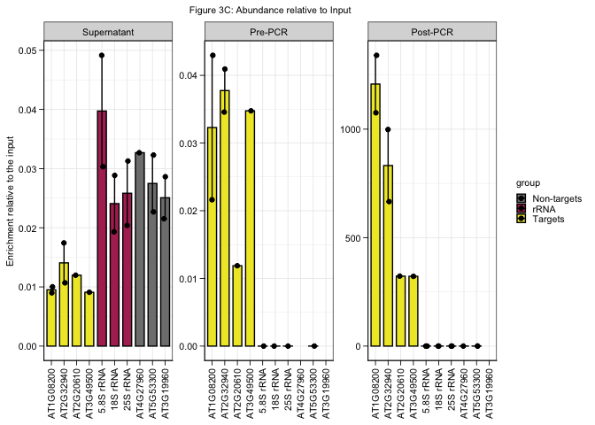
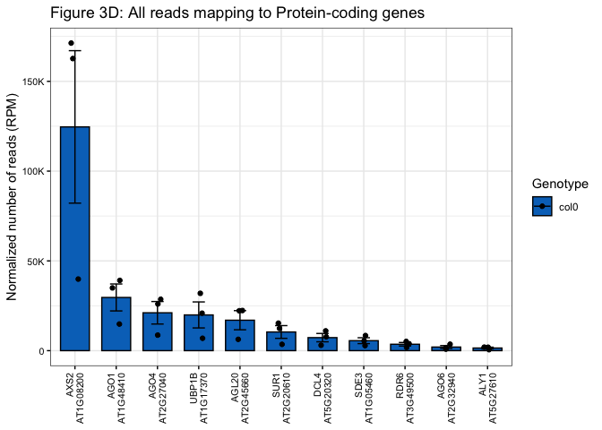
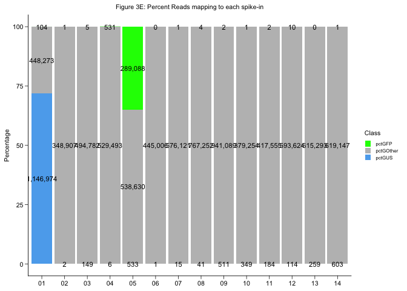
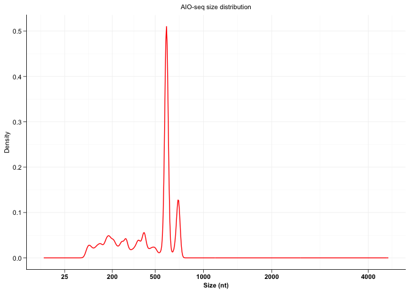
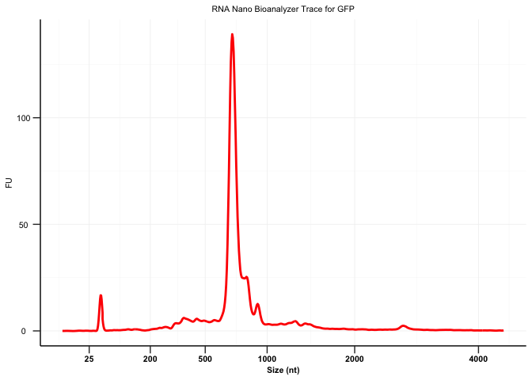

Figure_3
================

This is an [R Markdown](http://rmarkdown.rstudio.com) Notebook. When you
execute code within the notebook, the results appear beneath the code.

Try executing this chunk by clicking the *Run* button within the chunk
or by placing your cursor inside it and pressing *Cmd+Shift+Enter*.

``` r
library(ggpubr)
```

    ## Loading required package: ggplot2

``` r
library(tidyverse)
```

    ## ── Attaching core tidyverse packages ──────────────────────── tidyverse 2.0.0 ──
    ## ✔ dplyr     1.1.4     ✔ readr     2.1.5
    ## ✔ forcats   1.0.0     ✔ stringr   1.5.1
    ## ✔ lubridate 1.9.3     ✔ tibble    3.2.1
    ## ✔ purrr     1.0.2     ✔ tidyr     1.3.1

    ## ── Conflicts ────────────────────────────────────────── tidyverse_conflicts() ──
    ## ✖ dplyr::filter() masks stats::filter()
    ## ✖ dplyr::lag()    masks stats::lag()
    ## ℹ Use the conflicted package (<http://conflicted.r-lib.org/>) to force all conflicts to become errors

``` r
library("readxl")
library(ggrepel)
```

    ## Warning: package 'ggrepel' was built under R version 4.3.3

``` r
library(janitor)
```

    ## 
    ## Attaching package: 'janitor'
    ## 
    ## The following objects are masked from 'package:stats':
    ## 
    ##     chisq.test, fisher.test

``` r
library(RColorBrewer)
library(patchwork)
library("ggsci")
```

    ## Warning: package 'ggsci' was built under R version 4.3.3

``` r
library("scales")
```

    ## 
    ## Attaching package: 'scales'
    ## 
    ## The following object is masked from 'package:purrr':
    ## 
    ##     discard
    ## 
    ## The following object is masked from 'package:readr':
    ## 
    ##     col_factor

``` r
## Figure 3C
setwd("/Users/mariannekramer/Google Drive/Kramer_et_al_AIO/Figures/qPCR_validation_at_rnd23/")

## Read in files with qPCR data
atrnd2_1 <- read_excel("/Users/mariannekramer/Google Drive/Kramer_et_al_AIO/Figures/qPCR_validation_at_rnd23/220314_at_gm_target_capture_valid_contam_plate1.xlsx",sheet="Results",range="D52:O147",col_names = c("Sample","Target","task","reporter","quencher","quantity","quant mean","quant sd","rq","rq min","rq max","CT"))
atrnd2_2 <- read_excel("/Users/mariannekramer/Google Drive/Kramer_et_al_AIO/Figures/qPCR_validation_at_rnd23/230817_rRNA_check_plate1.xlsx",sheet="Results",range="D48:O83",col_names = c("Sample","Target","task","reporter","quencher","quantity","quant mean","quant sd","rq","rq min","rq max","CT"))

atrnd3_1 <- read_excel("/Users/mariannekramer/Google Drive/Kramer_et_al_AIO/Figures/qPCR_validation_at_rnd23/230902_atrnd3_3_plate1.xlsx",sheet="Results",range="D48:O167",col_names =c("Sample","Target","task","reporter","quencher","quantity","quant mean","quant sd","rq","rq min","rq max","CT"))
atrnd3_2 <- read_excel("/Users/mariannekramer/Google Drive/Kramer_et_al_AIO/Figures/qPCR_validation_at_rnd23/230902_atrnd3_3_plate2.xlsx",sheet="Results",range="D48:O77",col_names =c("Sample","Target","task","reporter","quencher","quantity","quant mean","quant sd","rq","rq min","rq max","CT"))
#Contains Input qPCR data
atrnd3_3 <- read_excel("/Users/mariannekramer/Google Drive/Kramer_et_al_AIO/Figures/qPCR_validation_at_rnd23/230729_at_rnd3_validation_plate1.xlsx",sheet="Results",range="D48:O71",col_names =c("Sample","Target","task","reporter","quencher","quantity","quant mean","quant sd","rq","rq min","rq max","CT"))
atrnd3_4 <- read_excel("/Users/mariannekramer/Google Drive/Kramer_et_al_AIO/Figures/qPCR_validation_at_rnd23/230817_rRNA_check_plate1.xlsx",sheet="Results",range="D84:O95",col_names =c("Sample","Target","task","reporter","quencher","quantity","quant mean","quant sd","rq","rq min","rq max","CT"))

## Combine df from same experiemnt and reorganize and rename data sets for further downstream processing 
at2_data <- rbind(atrnd2_1,atrnd2_2) %>% mutate(Sample = case_when(Sample == "At Rnd 2 Col-0 Input" ~"At Rnd 2 Input", Sample == "At Rnd 2 Sup" ~"At Rnd 2 Supernatant",TRUE~Sample)) %>% select(Sample, Target, CT) %>% separate(Sample,into=c("At","Rnd","Two","Type"),sep=" ") %>% tidyr::unite("Round",At:Two,sep = " ") %>% mutate(CT = as.numeric(na_if(CT,"Undetermined")),Target = case_when(grepl("AGO",Target) ~ "AGO6", TRUE ~ Target)) %>% filter(Target != "mPing" & Target != "i7/i5" & Target != "GUS")
at3_data <- rbind(atrnd3_1,atrnd3_2,atrnd3_3,atrnd3_4) %>% select(Sample, Target, CT) %>% filter(Sample != "Water" & Sample != "At Rnd 3-3 Post-PCR") %>% separate(Sample,into=c("At","Rnd","Three","Type"),sep=" ")%>% tidyr::unite("Round",At:Three,sep = " ") %>% mutate(CT = as.numeric(na_if(CT,"Undetermined")),Target = case_when(grepl("AGO",Target) ~ "AGO6", TRUE ~ Target)) %>% filter(Target != "eGFP")

## Calculate the average CT for each gene in the input sample for downstream normalization
at2_input <- at2_data %>% 
  filter(Type == "Input") %>%
  group_by(Target) %>%
  dplyr::summarize(avg_input_CT = mean(CT))
at3_input <- at3_data %>% 
  filter(Type == "Input") %>%
  group_by(Target) %>%
  dplyr::summarize(avg_input_CT = mean(CT))

## Calculate dCT of targets in Supernatant, and Post- capture, either Pre-PCR or Post-PCR by normalizing to input
## Transform Ct to RQ by 2^-Ct
at2_analysis <- at2_data %>%
  right_join(at2_input, by = c("Target")) %>%
  mutate(dCt = CT-avg_input_CT) %>%
  mutate(RQ = 2**(-dCt))
at3_analysis <- at3_data %>%
  right_join(at3_input, by = c("Target")) %>%
  mutate(dCt = CT-avg_input_CT) %>%
  mutate(RQ = 2**(-dCt))


## Calculate the sum and standard error of the mean for plotting, create "group" based on whether the genes were targets, non-targets, or rRNA
at2_toPlot.sum <- at2_analysis %>% group_by(Round,Type, Target) %>%
  dplyr::summarize(sem = sd(RQ)/sqrt(n()), RQ=mean(RQ)) %>% filter(!grepl("Input",Type,ignore.case=TRUE)) %>%
  mutate(group = case_when(Target == "ATM1 ex11" | Target == "UBC10" | Target == "UBC9"  ~ "Not on Array",  grepl("rRNA",Target) ~ "rRNA",TRUE ~ "On array"))
```

    ## `summarise()` has grouped output by 'Round', 'Type'. You can override using the
    ## `.groups` argument.

``` r
at3_toPlot.sum <- at3_analysis %>% group_by(Round,Type, Target) %>%
  dplyr::summarize(sem = sd(RQ)/sqrt(n()),RQ=mean(RQ)) %>% filter(!grepl("Input",Type,ignore.case=TRUE)) %>%
  mutate(group = case_when(Target == "ATM1 ex11" | Target == "UBC10" | Target == "UBC9"  ~ "Not on Array", grepl("rRNA",Target) ~ "rRNA",TRUE ~ "On array"))
```

    ## `summarise()` has grouped output by 'Round', 'Type'. You can override using the
    ## `.groups` argument.

``` r
## Create themes for plotting image preferences

themes <- theme(legend.position = "right", 
                axis.ticks.length=unit(0.0516,"in"),
                line = element_line(color = 'black',linewidth=0.3,lineend="round"),
                plot.title=element_text(hjust=0.5, color = 'black', size = 8), 
                axis.title.x= element_blank(), 
                axis.text.x=element_text(color = 'black',size = 8), 
                axis.line=element_line(color = 'black'), 
                axis.text.y= element_text(color = 'black',size = 8),
                axis.title.y= element_text(color = 'black',size = 8),
                legend.text=element_text(color = 'black',size = 8),
                legend.title = element_text(color = 'black',size = 8),
                strip.text=element_text(color='black',size=8),
                panel.background = element_blank(),
                legend.key.size= unit(0.3,"cm"))

## Combine two experiments
at23_toPlot.sum <- rbind(at2_toPlot.sum,at3_toPlot.sum)%>% filter(Target !="25S rRNA -2") %>%
  mutate(Type = case_when(Type == "Post-PCR+5" ~ "Post-PCR", TRUE ~ Type)) %>%
  mutate(Target = case_when(Target == "AT1G08200 ex5" ~ "AT1G08200", Target == "AGO6" ~ "AT2G32940",
                            Target == "RDR6 -1" ~ "AT3G49500",Target == "UBC10" ~ "AT5G53300",
                            Target == "UBC9" ~ "AT4G27960", Target == "ATM1 ex11" ~ "AT3G19960",
                            Target == "TyrAT ex5" ~ "AT2G20610",Target == "18S rRNA -1" ~ "18S rRNA",
                            Target == "25S rRNA -1" ~ "25S rRNA", TRUE~Target),
         group = case_when(group == "Not on Array" ~ "Non-targets", group == "On array"~"Targets",TRUE~group))

## Reorder facets
at23_toPlot.sum$Type <- factor(at23_toPlot.sum$Type, 
                               levels = c("Supernatant", "Pre-PCR", "Post-PCR")) 
## Plot
ggbarplot(at23_toPlot.sum,x="Target",y="RQ",fill="group",color="group",position=position_dodge(0.75),
          add = c("mean_se","jitter"),ylab="Enrichment relative to the input",
          title = "Figure 3C: Abundance relative to Input",x.text.angle=90,palette=c("gray50","maroon","#EFE731"),
          ggtheme=theme_bw(),font.tickslab = c(12,'black'),add.params = list(width = 0.3),facet.by = "Type",scales="free_y",
          order = c("AT1G08200","AT2G32940","AT2G20610","AT3G49500","5.8S rRNA","18S rRNA","25S rRNA","AT4G27960","AT5G53300","AT3G19960"))+
  scale_color_manual(values = c("black","black","black")) + themes
```

    ## Warning in stats::qt(ci/2 + 0.5, data_sum$length - 1): NaNs produced
    ## Warning in stats::qt(ci/2 + 0.5, data_sum$length - 1): NaNs produced
    ## Warning in stats::qt(ci/2 + 0.5, data_sum$length - 1): NaNs produced
    ## Warning in stats::qt(ci/2 + 0.5, data_sum$length - 1): NaNs produced
    ## Warning in stats::qt(ci/2 + 0.5, data_sum$length - 1): NaNs produced
    ## Warning in stats::qt(ci/2 + 0.5, data_sum$length - 1): NaNs produced
    ## Warning in stats::qt(ci/2 + 0.5, data_sum$length - 1): NaNs produced
    ## Warning in stats::qt(ci/2 + 0.5, data_sum$length - 1): NaNs produced
    ## Warning in stats::qt(ci/2 + 0.5, data_sum$length - 1): NaNs produced
    ## Warning in stats::qt(ci/2 + 0.5, data_sum$length - 1): NaNs produced

    ## Warning in base::min(x, na.rm = TRUE): no non-missing arguments to min;
    ## returning Inf

    ## Warning in base::max(x, na.rm = TRUE): no non-missing arguments to max;
    ## returning -Inf

    ## Warning in stats::qt(ci/2 + 0.5, data_sum$length - 1): NaNs produced
    ## Warning in stats::qt(ci/2 + 0.5, data_sum$length - 1): NaNs produced
    ## Warning in stats::qt(ci/2 + 0.5, data_sum$length - 1): NaNs produced

    ## Warning in base::min(x, na.rm = TRUE): no non-missing arguments to min;
    ## returning Inf

    ## Warning in base::max(x, na.rm = TRUE): no non-missing arguments to max;
    ## returning -Inf

    ## Warning in stats::qt(ci/2 + 0.5, data_sum$length - 1): NaNs produced

    ## Warning in base::min(x, na.rm = TRUE): no non-missing arguments to min;
    ## returning Inf

    ## Warning in base::max(x, na.rm = TRUE): no non-missing arguments to max;
    ## returning -Inf

    ## Warning in stats::qt(ci/2 + 0.5, data_sum$length - 1): NaNs produced

    ## Scale for colour is already present.
    ## Adding another scale for colour, which will replace the existing scale.

    ## Warning: Removed 6 rows containing non-finite outside the scale range
    ## (`stat_summary()`).

    ## Warning: Removed 3 rows containing missing values or values outside the scale range
    ## (`geom_bar()`).

    ## Warning: Removed 6 rows containing missing values or values outside the scale range
    ## (`geom_point()`).

<!-- -->

``` r
## Figure 3D
## Create themes for plotting image preferences
themes <- theme(plot.title = element_text(size=8,color='black',hjust = 0.5),
                axis.text = element_text(size=8,color = 'black'),
                axis.title.x = element_blank(),
                axis.title.y = element_text(color = "black",size=8),
                strip.text = element_text(color = "black",size=8),
                legend.position = 'top',
                legend.key.size= unit(0.3,"in"),
                legend.text = element_text(color = "black",size=6),
                legend.title = element_text(color = "black",size=6),
                line = element_line(color = 'black',linewidth=0.3,lineend="round"),
                axis.line=element_line(color='black',linewidth=0.3,lineend="round"),
                axis.ticks=element_line(color='black',linewidth=0.3,lineend="round"),
                panel.background = element_blank(),
                panel.grid.major = element_line(color = 'grey95'),
                panel.grid.minor = element_line(color = 'grey95'),
                axis.ticks.length=unit(0.0516,"in"))

## Read in file of total number of reads per library for normalization
inNorm <- read.table("/Users/mariannekramer/Google Drive/Kramer_et_al_AIO/Figures/at_mutants/number_reads_mapped.at_round2_3.txt",header = TRUE)
norm <- inNorm %>% transmute(sample, MapTotal = rRNA+Targets+Non.targets) 

## Read in file containing what class each target is (i.e. protein-coding gene, TE, transgene etc)
classes <- "/Users/mariannekramer/Google Drive/Kramer_et_al_AIO/Figures/at_mutants/At_array.v1.Arabidopsis_thaliana.TAIR10.56.Araport11_transposable_element.current.targetChr.construct.transgenes.targets_class.txt"
inClass <- read.table(classes, col.names = c("FaName","Gene","Class"), as.is = T)
inClass <- inClass %>% separate(FaName, into = c("faName"),sep="_")
```

    ## Warning: Expected 1 pieces. Additional pieces discarded in 67 rows [3, 4, 5, 6, 7, 8, 9,
    ## 10, 11, 12, 13, 14, 15, 16, 17, 18, 19, 20, 21, 22, ...].

``` r
########################################
#01# All reads
########################################
## Read in files of number of reads mapped to each target for two independent experiments with shared genotypes
round2.all <- read.table("/Users/mariannekramer/Google Drive/Kramer_et_al_AIO/Figures/at_mutants/all.combined_numReads_mapped_to_targets.strandedness.perpA.at_round2.txt", header = T, as.is = T)
round3.all <- read.table("/Users/mariannekramer/Google Drive/Kramer_et_al_AIO/Figures/at_mutants/all.combined_numReads_mapped_to_targets.strandedness.perpA.at_round3.txt", header = T, as.is = T)

# Combine all genotypes
mergeFile.all <- rbind(round2.all,round3.all) %>%
  tidyr::unite(Gene,c(Gene,Name,Class),sep="__") %>% 
  complete(Gene,Sample,fill=list(Sense_non_pA=0,Anti_non_pA=0,Sense_pA=0,Anti_pA=0,Total=0)) %>% 
  separate(Gene,into=c("Gene","Name","Class"),sep="__") 

# Normalize by sample size
norm.All <- norm %>% left_join(mergeFile.all,by=c("sample"="Sample")) %>% 
  transmute(Gene,Name,Class,sample,
            normSense_nonpA= (Sense_non_pA/MapTotal)*1000000,normAnti_nonpA= (Anti_non_pA/MapTotal)*1000000,
            normSense_pA= (Sense_pA/MapTotal)*1000000,normAnti_pA= (Anti_pA/MapTotal)*1000000) %>% 
  rowwise() %>% 
  mutate(normTotal=normSense_nonpA+normAnti_nonpA+normSense_pA+normAnti_pA) %>% 
  mutate(Name = case_when(Gene==Name ~ "", TRUE~ Name),
         pctSensepA = (normSense_pA/normTotal)*100, pctAntipA = (normAnti_pA/normTotal)*100,
         pctSensenonpA = (normSense_nonpA/normTotal)*100, pctAntinonpA = (normAnti_nonpA/normTotal)*100) %>% mutate_if(is.numeric, ~replace(.,is.nan(.), 0)) %>% 
  tidyr::unite(Name,c(Name,Gene),sep="\n") %>% 
  mutate(sample = case_when(sample =="1_col0" ~ "1_col0_rep1" , sample == "2_poliv" ~ "2_poliv_rep0", sample == "3_polv" ~ "3_polv_rep1", sample == "4_poliv_polv" ~ "4_polivpolv_rep1", sample == "5_ago6" ~ "5_ago6_rep1", sample == "6_FLAG_AGO6" ~ "6_FLAGAGO6_rep1",sample == "7_rdr6" ~ "7_rdr6_rep1", sample == "8_RDR6_GFP" ~ "8_RDR6GFP_rep1",sample == "9_ddm1" ~ "9_ddm1_rep1", TRUE ~ sample))

## Filter file for protein coding genes in Wt Col-0
all.pcg <-     norm.All %>% filter(Class == "Protein-coding" & grepl("col0",sample) & !grepl("TE",Name) & !grepl("AT1G07590",Name)) %>% select(Name:normTotal) %>%   group_by(Name,sample,Class) %>%  dplyr::summarize(normSense_nonpA=sum(normSense_nonpA),normAnti_nonpA=sum(normAnti_nonpA),normSense_pA=sum(normSense_pA), normAnti_pA=sum(normAnti_pA)) %>% rowwise() %>% mutate(normTotal=normSense_nonpA+normAnti_nonpA+normSense_pA+normAnti_pA,Sample = "All")  %>% separate(sample,into=c("num","Genotype","rep"))
```

    ## `summarise()` has grouped output by 'Name', 'sample'. You can override using
    ## the `.groups` argument.

``` r
## Define color for Col-0
col0Col <- "#0073C2FF"

## Plot
ggbarplot(data = all.pcg, x="Name",y="normTotal",fill="Genotype",color="Genotype",ylab = "Normalized number of reads (RPM)", xlab= FALSE,
                        position=position_dodge(0.75),sort.val="desc",
                        palette=c(col0Col),
                        add = c("mean_se","jitter"),
                        title = "Figure 3D: All reads mapping to Protein-coding genes",x.text.angle=90,ggtheme=theme_bw(),font.tickslab = c(8,'black'),add.params = list(width = 0.3)) +scale_color_manual(values = c(col0 = "black")) + scale_y_continuous(labels=scales::label_number(scale_cut = cut_short_scale()))
```

    ## Scale for colour is already present.
    ## Adding another scale for colour, which will replace the existing scale.

<!-- -->

``` r
## Figure 3E
## Read in data of number of reads mapping to GFP or GUS
data1 <- read.table("/Users/mariannekramer/Google Drive/Kramer_et_al_AIO/Figures/Demultiplexing_efficiency/number_reads_gus_egfp.at_round3.demulti.trimmed.txt", header = T, as.is=T)

## Calculate the percentage of reads mapping to GFP or GUS
pct1 <- data1 %>% 
  rowwise() %>%
  mutate(sample,pctGFP = gfp/total*100,pctGUS = gus/total*100, pctGOther = (total-gfp-gus)/total*100) %>%
  pivot_longer(cols=c(pctGFP, pctGUS,pctGOther),names_to="Class")%>%
  transmute(sample, Class, value, total,reads =value * total/100) %>% separate(sample,into = c("sample","Geno","Rep")) %>%
  mutate(across(value, \(x) round(x, 2))) %>%
  mutate(reads_label = if_else(!is.na(reads), label_comma()(reads), NA_character_))

## Create themes for plotting image preferences
themes <- theme(legend.position = "right", 
                axis.ticks.length=unit(0.0516,"in"),
                line = element_line(color = 'black',linewidth=0.3,lineend="round"),
                plot.title=element_text(hjust=0.5, color = 'black', size = 8), 
                axis.title.x= element_blank(), 
                axis.text.x=element_text(color = 'black',size = 8), 
                axis.line=element_line(color = 'black'), 
                axis.text.y= element_text(color = 'black',size = 8),
                axis.title.y= element_text(color = 'black',size = 8),
                legend.text=element_text(color = 'black',size = 6),
                legend.key.size= unit(0.3,"cm"),
                legend.title = element_text(color = 'black',size = 8),
                strip.text=element_text(color='black',size=8),
                panel.background = element_blank())

## Plot
ggplot(pct1,aes(x=sample,y=value,fill=Class,label=reads)) + 
  geom_col()+
  geom_text(aes(label = reads_label), position = position_stack(vjust = 0.5),size=3)+ 
  themes + ggtitle("Figure 3E: Percent Reads mapping to each spike-in") + ylab("Percentage") + 
  scale_fill_manual(values=c("Green","Gray","steelblue2"))
```

<!-- -->

``` r
## Figure 3F

## All-in-One "BioA" Make bioA trace based on read lengths
## Read in files containing length of reads mapping to GFP in two independent experiments
inRaw1 <- read.table("/Users/mariannekramer/Google Drive/Kramer_et_al_AIO/Figures/gfp_gus_coverage_plots/02_MK017_rep1.35S.8green.non_pA.filtered.rRNA_free.mapped_to_targets.eGFP.len.txt",col.names=c("Name","Length"))
inRaw2 <- read.table("/Users/mariannekramer/Google Drive/Kramer_et_al_AIO/Figures/gfp_gus_coverage_plots/05_poliv_rep1.non_pA.filtered.rRNA_free.mapped_to_targets.eGFP.len.txt",col.names=c("Name","Length"))

merged.len <- rbind(inRaw1,inRaw2) 

## Plot
ggplot(merged.len,aes(x=Length)) + geom_density(kernel="gaussian",color = "red") + 
  scale_x_continuous(trans='sqrt',limits=c(1,4500),breaks=c(25,200,500,1000,2000,4000),name = "Size (nt)") + themes + 
  theme(axis.text.x= element_text(color = 'black',size = 8, face = 'bold',angle=0,hjust=0.5),
        axis.title.x= element_text(color = 'black',size = 8, face = 'bold'),panel.background = element_blank(),
        panel.grid.major = element_line(color = 'gray95',linewidth=0.3,lineend="round"),
        panel.grid.minor = element_line(color = 'gray95',linewidth=0.1,lineend="round")) + 
  xlab("Read size")+ggtitle("AIO-seq size distribution") + ylab("Density")
```

<!-- -->

``` r
## Agilent Bioanalyzer Plot
## Read in files containing raw output from Agilent RNA Nano assay
fileName1 <-"/Users/mariannekramer/Google Drive/Kramer_et_al_AIO/Figures/gfp_gus_coverage_plots/real_bioa/220624_selected_samples.Ladder.byHand.xlsx"
fileName2 <-"/Users/mariannekramer/Google Drive/Kramer_et_al_AIO/Figures/gfp_gus_coverage_plots/real_bioa/220624_selected_samples.Sample2.csv"

inLadder <- read_excel(fileName1,sheet="Sheet1",range="A1:C23",col_names = T)
inGFP <- read.csv(fileName2,skip = 16, header =T,blank.lines.skip   =T)


## Create themes for plotting image preferences
themes<-theme(axis.ticks.length.y=unit(0.25,"cm"),axis.ticks.length.x=unit(0.25,"cm"),
              axis.title.x=element_blank(),
              axis.text.x= element_blank(),
              axis.text.y= element_text(color = 'black',size = 8,hjust=0.5), 
              axis.line.x=element_line(color='black'),axis.line.y=element_line(color='black'),
              axis.title.y=element_text(color = 'black',size = 8),
              panel.background = element_blank(),
              panel.grid.major = element_line(color = 'grey95'),
              panel.grid.minor = element_line(color = 'grey95'),plot.title=element_text(hjust=0.5, color = 'black', size = 8))


## Get equation for polynomial with order 4 (this is what is done in the Agilent BioA program in "Assay Properties")
my.formula <- Size ~ poly(Time, 4,raw=T)
m <- lm(my.formula, inLadder)

# Extract and round the coefficients
coefficients <- signif(coef(m), 3)

# Construct the equation manually
terms <- paste0(" + ", coefficients[-1], " * Time^", 1:4)
my.eq <- paste0("y = ", coefficients[1], paste(terms, collapse = ""))
my.eq <- gsub("\\+ -", "- ", my.eq)  # Clean up formatting for negative signs

print(my.eq)
```

    ## [1] "y = -2520 + 363 * Time^1 - 19.3 * Time^2 + 0.428 * Time^3 - 0.00276 * Time^4"

``` r
## Plot ladder
x<-ggplot(inLadder,aes(x=Time,y=Size)) + geom_point(color = "red") + themes + geom_smooth(method = "lm", formula = y ~ poly(x, 4))+ 
  theme(axis.text.x= element_text(color = 'black',size = 8,angle=0,hjust=0.5),
        axis.title.x= element_text(color = 'black',size = 8),panel.background = element_blank(),
        panel.grid.major = element_line(color = 'gray95',linewidth=0.3,lineend="round"),
        panel.grid.minor = element_line(color = 'gray95',linewidth=0.1,lineend="round")) 

## Use my.eq to calculate size from Time
toPlot <- inGFP  %>% mutate(Time=as.numeric(Time),Value=as.numeric(Value), 
                 Size = round(-2520 + (363*Time) - (19.3*(Time**2)) + (0.428*(Time**3)) - (0.00276*(Time**4)),0))

## Plot
ggplot(toPlot,aes(x=Size,y=Value)) +  themes + geom_line(color="red",linewidth=1) +
  theme(axis.text.x= element_text(color = 'black',size = 8, face = 'bold',angle=0,hjust=0.5),
        axis.title.x= element_text(color = 'black',size = 8, face = 'bold'),panel.background = element_blank(),
        panel.grid.major = element_line(color = 'gray95',linewidth=0.3,lineend="round"),
        panel.grid.minor = element_line(color = 'gray95',linewidth=0.1,lineend="round")) +
  scale_x_continuous(trans='sqrt',limits=c(1,4500),breaks=c(25,200,500,1000,2000,4000)) +
  ggtitle("RNA Nano Bioanalyzer Trace for GFP")+ ylab("FU") +xlab("Size (nt)")
```

    ## Warning in transformation$transform(x): NaNs produced

    ## Warning in scale_x_continuous(trans = "sqrt", limits = c(1, 4500), breaks =
    ## c(25, : sqrt transformation introduced infinite values.

    ## Warning: Removed 394 rows containing missing values or values outside the scale range
    ## (`geom_line()`).

<!-- -->
