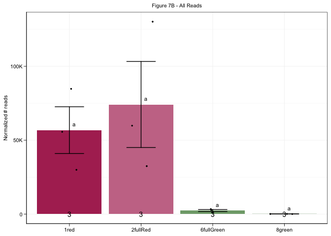
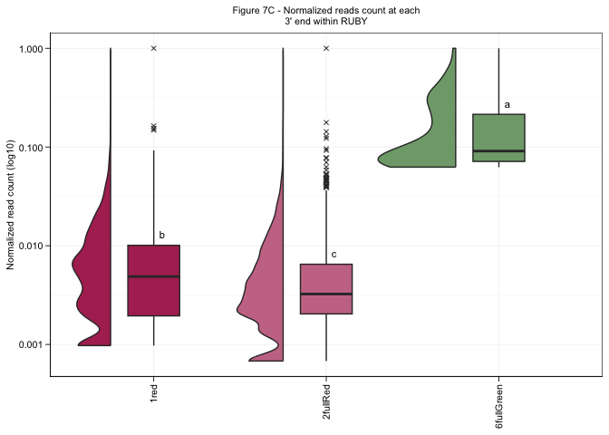
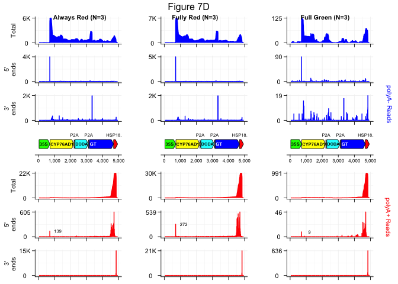
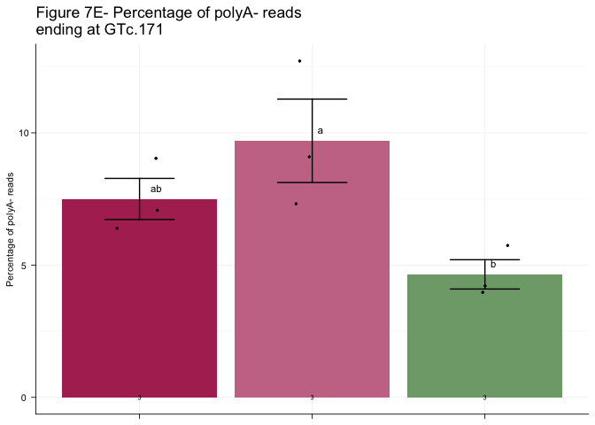
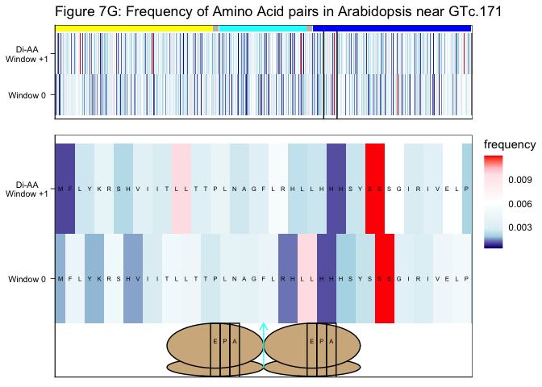

Figure_7
================

This is an [R Markdown](http://rmarkdown.rstudio.com) Notebook. When you
execute code within the notebook, the results appear beneath the code.

``` r
## Get Relevant Packages
library(tidyverse)
```

    ## ── Attaching core tidyverse packages ──────────────────────── tidyverse 2.0.0 ──
    ## ✔ dplyr     1.1.4     ✔ readr     2.1.5
    ## ✔ forcats   1.0.0     ✔ stringr   1.5.1
    ## ✔ ggplot2   3.5.1     ✔ tibble    3.2.1
    ## ✔ lubridate 1.9.3     ✔ tidyr     1.3.1
    ## ✔ purrr     1.0.2     
    ## ── Conflicts ────────────────────────────────────────── tidyverse_conflicts() ──
    ## ✖ dplyr::filter() masks stats::filter()
    ## ✖ dplyr::lag()    masks stats::lag()
    ## ℹ Use the conflicted package (<http://conflicted.r-lib.org/>) to force all conflicts to become errors

``` r
library(ggrepel)
```

    ## Warning: package 'ggrepel' was built under R version 4.3.3

``` r
library(ggpubr)
library(janitor)
```

    ## 
    ## Attaching package: 'janitor'
    ## 
    ## The following objects are masked from 'package:stats':
    ## 
    ##     chisq.test, fisher.test

``` r
library(RColorBrewer)
library(patchwork)
```

    ## Warning: package 'patchwork' was built under R version 4.3.3

``` r
library("ggsci")
```

    ## Warning: package 'ggsci' was built under R version 4.3.3

``` r
library("scales")
```

    ## 
    ## Attaching package: 'scales'
    ## 
    ## The following object is masked from 'package:purrr':
    ## 
    ##     discard
    ## 
    ## The following object is masked from 'package:readr':
    ## 
    ##     col_factor

``` r
library(ggh4x)
```

    ## 
    ## Attaching package: 'ggh4x'
    ## 
    ## The following object is masked from 'package:ggplot2':
    ## 
    ##     guide_axis_logticks

``` r
library(see)
```

    ## Warning: package 'see' was built under R version 4.3.3

    ## 
    ## Attaching package: 'see'
    ## 
    ## The following objects are masked from 'package:ggsci':
    ## 
    ##     scale_color_material, scale_colour_material, scale_fill_material

``` r
library(gggenes)
library(multcompView)
library(Biostrings)
```

    ## Warning: package 'Biostrings' was built under R version 4.3.3

    ## Loading required package: BiocGenerics
    ## 
    ## Attaching package: 'BiocGenerics'
    ## 
    ## The following objects are masked from 'package:lubridate':
    ## 
    ##     intersect, setdiff, union
    ## 
    ## The following objects are masked from 'package:dplyr':
    ## 
    ##     combine, intersect, setdiff, union
    ## 
    ## The following objects are masked from 'package:stats':
    ## 
    ##     IQR, mad, sd, var, xtabs
    ## 
    ## The following objects are masked from 'package:base':
    ## 
    ##     anyDuplicated, aperm, append, as.data.frame, basename, cbind,
    ##     colnames, dirname, do.call, duplicated, eval, evalq, Filter, Find,
    ##     get, grep, grepl, intersect, is.unsorted, lapply, Map, mapply,
    ##     match, mget, order, paste, pmax, pmax.int, pmin, pmin.int,
    ##     Position, rank, rbind, Reduce, rownames, sapply, setdiff, sort,
    ##     table, tapply, union, unique, unsplit, which.max, which.min
    ## 
    ## Loading required package: S4Vectors
    ## Loading required package: stats4
    ## 
    ## Attaching package: 'S4Vectors'
    ## 
    ## The following objects are masked from 'package:lubridate':
    ## 
    ##     second, second<-
    ## 
    ## The following objects are masked from 'package:dplyr':
    ## 
    ##     first, rename
    ## 
    ## The following object is masked from 'package:tidyr':
    ## 
    ##     expand
    ## 
    ## The following object is masked from 'package:utils':
    ## 
    ##     findMatches
    ## 
    ## The following objects are masked from 'package:base':
    ## 
    ##     expand.grid, I, unname
    ## 
    ## Loading required package: IRanges
    ## 
    ## Attaching package: 'IRanges'
    ## 
    ## The following object is masked from 'package:lubridate':
    ## 
    ##     %within%
    ## 
    ## The following objects are masked from 'package:dplyr':
    ## 
    ##     collapse, desc, slice
    ## 
    ## The following object is masked from 'package:purrr':
    ## 
    ##     reduce
    ## 
    ## Loading required package: XVector
    ## 
    ## Attaching package: 'XVector'
    ## 
    ## The following object is masked from 'package:purrr':
    ## 
    ##     compact
    ## 
    ## Loading required package: GenomeInfoDb

    ## Warning: package 'GenomeInfoDb' was built under R version 4.3.3

    ## 
    ## Attaching package: 'Biostrings'
    ## 
    ## The following object is masked from 'package:base':
    ## 
    ##     strsplit

``` r
library(zoo)
```

    ## 
    ## Attaching package: 'zoo'
    ## 
    ## The following objects are masked from 'package:base':
    ## 
    ##     as.Date, as.Date.numeric

``` r
library(ggforce)
```

``` r
## Set themes
themes <- theme(plot.title = element_text(size=8,color='black',hjust = 0.5),
                axis.text = element_text(size=8,color = 'black'),
                axis.title.x = element_blank(),
                axis.title.y = element_text(color = "black",size=8),
                strip.text = element_text(color = "black",size=8),
                legend.position = 'top',
                legend.key.size= unit(0.3,"cm"),
                legend.text = element_text(color = "black",size=6),
                legend.title = element_text(color = "black",size=6),
                line = element_line(color = 'black',linewidth=0.3,lineend="round"),
                axis.line=element_line(color='black',linewidth=0.3,lineend="round"),
                axis.ticks.length=unit(0.0516,"in"),
                axis.ticks=element_line(color='black',linewidth=0.3,lineend="round"),
                panel.background = element_blank(),
                panel.grid.major = element_line(color = 'grey95'),
                panel.grid.minor = element_line(color = 'grey95'))
```

## Figure 7B - All Reads mapping to RUBY

``` r
# Read in file to normalize
inNorm <- read.table("/Users/mariannekramer/Google Drive/Kramer_et_al_AIO/Figures/ruby_aio_read_Count/lettuce/number_reads_mapped.ruby_round4.txt",header = TRUE)
norm <- inNorm %>% transmute(sample, MapTotal = rRNA+Targets+Non.targets)

## Read in file with all reads mapping to RUBY per sample
round4.all <- read.table("/Users/mariannekramer/Google Drive/Kramer_et_al_AIO/Figures/ruby_aio_read_Count/lettuce/all.combined_numReads_mapped_to_targets.strandedness.perpA.round4.txt", header = T, as.is = T)


# Format df
mergeFile.all <- round4.all %>% 
  mutate(Name = case_when(grepl("RUBY",Gene) ~ "RUBY", TRUE ~ Name),Gene = case_when(grepl("RUBY",Gene) ~ "RUBY", TRUE ~ Gene)) %>%
  tidyr::unite(tmp,c(Gene,Name,Class),sep="__") %>% 
  complete(tmp,Sample,fill=list(Sense_non_pA=0,Sense_pA=0,Total=0)) %>% 
  separate(tmp,into=c("Gene","Name","Class"),sep="__") 

# Normalize by sample size
norm.All <- mergeFile.all %>% left_join(norm,by=c("Sample"="sample")) %>% 
  transmute(Gene,Name,Class,Sample,
            normSense_nonpA= round((Sense_non_pA/MapTotal)*1000000,2),
            normSense_pA= round((Sense_pA/MapTotal)*1000000,2)) %>% 
  rowwise() %>% mutate(normTotal=normSense_nonpA+normSense_pA) %>% 
  mutate(Name = case_when(Gene==Name ~ "", TRUE~ Name),
         pctSensepA = round((normSense_pA/normTotal)*100,2), 
         pctSensenonpA = round((normSense_nonpA/normTotal)*100,2)) %>% 
  mutate_if(is.numeric, ~replace(.,is.nan(.), 0)) %>% 
  tidyr::unite(Name,c(Gene,Name),sep="\n") %>% separate(Sample,into=c("genotype","promoter","phenotype"),sep="[.]") %>% 
  separate(genotype,into=c("num","plant","rep"),sep="_") %>% tidyr::unite(genotype, c(plant,rep),sep="_")

## Dfine Colors
phenoColors <- c("#B03060","#C97795","#7FA779","#006400")

## Filter and format df for plotting
all.RUBY2 <- norm.All %>% filter(grepl("RUBY",Name)&grepl("35S",promoter)) %>%  separate(genotype,into=c("Genotype","Rep")) %>% mutate(class = case_when(phenotype == "1red" ~ "Always Red", phenotype == "8green" ~ "Always Green",TRUE~ "Red-to-Green"),phenotype = case_when(phenotype == "5fullRed"~"2fullRed",TRUE ~ phenotype)) %>% mutate(Rep = str_replace(Rep,"rep","Rep ")) %>% 
  filter(phenotype != "3redParts")

## Perform ANOVA test
anova <- aov(normTotal ~ phenotype, data = all.RUBY2)
tukey <- TukeyHSD(anova)
tukey_df <- as.data.frame(tukey$phenotype)
tukey_df <- mutate(tukey_df, Sig = case_when(`p adj` < 0.001 ~ "***",`p adj` > 0.001 & `p adj` < 0.01 ~ "**",
                                             `p adj` > 0.01 & `p adj` < 0.05 ~ "*", TRUE ~ "NS"))
#write.table(tukey_df, file = "~/Google Drive/Kramer_et_al_AIO/Figures/ruby_aio_read_Count/end_at_3343/number_reads_ending_at_3343.all.pct.ANOVA.tukey.txt", quote=F, row.names = T, col.names=T, sep= "\t")
print(tukey_df)
```

    ##                           diff        lwr        upr      p adj Sig
    ## 2fullRed-1red        17384.880  -57689.47 92459.2327 0.87773199  NS
    ## 6fullGreen-1red     -54410.490 -129484.84 20663.8627 0.17210925  NS
    ## 8green-1red         -56719.483 -131793.84 18354.8693 0.15031219  NS
    ## 6fullGreen-2fullRed -71795.370 -146869.72  3278.9827 0.06089633  NS
    ## 8green-2fullRed     -74104.363 -149178.72   969.9893 0.05299902  NS
    ## 8green-6fullGreen    -2308.993  -77383.35 72765.3593 0.99962765  NS

``` r
## Assign letters for plot
cld <- multcompLetters4(anova, tukey)
Tk <- group_by(all.RUBY2, phenotype) %>%
  summarise(mean=mean(normTotal), quant = quantile(normTotal, probs = 0.75)) %>%
  arrange(desc(mean))

# extracting the compact letter display and adding to the Tk table
cld <- as.data.frame.list(cld$phenotype)
Tk$cld <- cld$Letters

all.RUBY2 %>% group_by(phenotype,class) %>% 
  dplyr::summarize(avg = mean(normTotal), sem = sd(normTotal)/sqrt(n()), numBR = n())  %>%
  ggplot(aes(x=phenotype,y=avg,fill=phenotype)) + 
  geom_col(position=position_dodge(0.9),color=NA)+ 
  geom_jitter(data=all.RUBY2,aes(x=phenotype,y=normTotal),width =0.2,size=0.5)+
  scale_y_continuous(labels=scales::label_number(scale_cut = cut_short_scale())) +
  geom_errorbar(aes(ymin=avg-sem, ymax=avg+sem), width=0.4,position=position_dodge(0.9),lineend="round")+
  theme_bw()+themes + scale_fill_manual(values=c(phenoColors))  + 
  ggtitle("Figure 7B - All Reads") + ylab("Normalized # reads") + 
  geom_text(aes(label=numBR),y = 0)+ theme(legend.position="none")+
  geom_text(data=Tk,aes(x=phenotype,y=mean,label=cld), size = 3, vjust=-1, hjust =-1)
```

    ## `summarise()` has grouped output by 'phenotype'. You can override using the
    ## `.groups` argument.

<!-- -->

## Figure 7C - Number of 3’ ends in lettuce

``` r
# Read in file
inFile1 <- read.table("/Users/mariannekramer/Google Drive/Kramer_et_al_AIO/Figures/ruby_3p_end_num/lettuce/all.combined_normalized_3p_read_count.ruby_round4.txt",header=T)

# Format df
data3 <- inFile1 %>% filter(grepl("35S_RUBY",name)& !grepl("3redParts",pheno) ) %>% 
  separate(pheno, into=c("sample","prom","pheno"),sep = "[.]") %>%
  mutate(pheno = case_when(pheno == "5fullRed" ~ "2fullRed",
                           pheno == "2reddish" ~ "9reddish",
                           prom == "35S_dcl1234" ~ "0red_dcl", TRUE~pheno),
         prom = case_when(prom == "35S_dcl1234" ~ "35S", TRUE~prom))%>%
  group_by(start,stop,prom,pheno) %>% 
  dplyr::summarize(merge_count = mean(count),merge_normScore = mean(normScore),if_merge=n()) %>%
  filter(pheno != "8green")
```

    ## `summarise()` has grouped output by 'start', 'stop', 'prom'. You can override
    ## using the `.groups` argument.

``` r
## Perform ANOVA test
anova <- aov(merge_normScore ~ pheno, data = data3)
tukey <- TukeyHSD(anova)
tukey_df <- as.data.frame(tukey$pheno)
tukey_df <- mutate(tukey_df, Sig = case_when(`p adj` < 0.001 ~ "***",`p adj` > 0.001 & `p adj` < 0.01 ~ "**",
                                             `p adj` > 0.01 & `p adj` < 0.05 ~ "*", TRUE ~ "NS"))
print(tukey_df)
```

    ##                             diff          lwr           upr      p adj Sig
    ## 2fullRed-1red       -0.002401697 -0.004526167 -0.0002772273 0.02198107   *
    ## 6fullGreen-1red      0.163470514  0.156586643  0.1703543848 0.00000000 ***
    ## 6fullGreen-2fullRed  0.165872211  0.159000349  0.1727440726 0.00000000 ***

``` r
#write.table(tukey_df, file = "normalized_3p_end_density.ruby.violin.lettuce.ANOVA.tukey.txt", quote=F, row.names = T, col.names=T, sep= "\t")

cld <- multcompLetters4(anova, tukey)

Tk <- group_by(data3, pheno) %>%
  dplyr::summarize(mean=mean(merge_normScore), quant = quantile(merge_normScore, probs = 0.75)) %>%
  arrange(desc(mean))

# extracting the compact letter display and adding to the Tk table
cld <- as.data.frame.list(cld$pheno)
Tk$cld <- cld$Letters

ggplot(data3,aes(x=pheno,y=merge_normScore,fill=pheno))   +
  geom_violinhalf(position = position_nudge(x = -0.25, y = 0),flip=T) +
  geom_boxplot(notch = F,outlier.shape=4,width = 0.3)+  
  theme_bw() + themes +
  scale_fill_manual(values=c("#B03060","#C97795","#7FA779"))+
  scale_color_manual(values=c("#B03060","#C97795","#7FA779"))+
  scale_y_log10()+ ylab("Normalized read count (log10)") + 
  ggtitle("Figure 7C - Normalized reads count at each\n3' end within RUBY") +
  theme(legend.position= "none",axis.text.x = element_text(size=8,color = 'black',angle = 90, vjust = 0.5, hjust=1),
        axis.text.y = element_text(size=8,color = 'black'))+
  geom_text(data=Tk,aes(x=pheno,y=quant,label=cld), size = 3, vjust=-1, hjust =-1) 
```

<!-- -->

## Figure 7D - Coverage plots in lettuce

``` r
## load gtf for transgene
infoFile <- "/Users/mariannekramer/Google Drive/Kramer_et_al_AIO/Figures/ruby_coverage_plots/35S_RUBY_transgene.bed"
geneInfo <-read.table(infoFile,col.names = c("molecule","Start","End","Name","Type","strand"))
target <- "35S_RUBY_transgene"
t<- geneInfo %>% rowwise() %>% transmute(molecule,Name,Type,Start=Start +1,End=End+1,
                                         Strand =ifelse(strand=="+","forward","reverse"),length=End-Start+1,
                                         orientation=ifelse(strand=="+",1, -1)) %>%
  filter(Name != "RB") %>% mutate(Name = case_when(Name == "CaMV_35S_promoter" ~ "35S",Name == "HSP18.2_terminator" ~ "HSP18.2",
                                                   Name == "Glucosyltransferase" ~ "GT",TRUE~Name))

tg <- ggplot(t,aes(xmin = Start, xmax = End, y = molecule,forward=orientation,label=Name)) +
  geom_gene_arrow(arrow_body_height = grid::unit(4, "mm"),arrowhead_height = unit(4, "mm"), arrowhead_width = unit(1, "mm"),
                  fill = dplyr::case_when(t$Type=="terminator"~ "red",
                                          t$Type=="promoter"~ "green",
                                          t$Name=="P2A"~ "gray",
                                          t$Name=="CYP76AD1"~ "yellow",
                                          t$Name=="DODA"~ "cyan1",
                                          t$Name=="GT"~ "blue",TRUE ~ "white"),
                  color = "black") + 
  xlab("Relative position along transgene")+scale_x_continuous(label=scales::label_comma())+
  geom_gene_label(fontface="bold", padding.y = grid::unit(0.01,"mm"), padding.x = grid::unit(0.2,"mm"),align = "left",
                  color=c("black","black","black","black","black","white","black"),grow=F,size=6) +
  theme(axis.ticks.y=element_blank(), axis.text.y= element_blank(),
        axis.text.x= element_text(color = 'black',size = 6),
        axis.title.y= element_blank(), 
        axis.line.x=element_line(color = 'black',linewidth=0.3,lineend="round"),panel.background = element_blank(),
        axis.title.x=element_blank(),axis.ticks.x=element_line(color='black',linewidth=0.3,lineend="round"))+
  annotate(geom="text",x=2240,y=1.5,label="P2A",size=2)+annotate(geom="text",x=3130,y=1.5,label="P2A",size=2)+
  annotate(geom="text",x=4780,y=1.5,label="HSP18.2",size=2)


## Always Red
fileName.red <- "/Users/mariannekramer/Google Drive/Kramer_et_al_AIO/Figures/ruby_coverage_plots.lettuce/bed12_files/Ls745_rep78_Ls608_rep9.35S.1red.rRNA_free.mapped_to_targets.non_pA"

## non_pA
coverage.red <- read.table(paste(fileName.red,".bed12",sep=""),col.names = c("name","start", "stop","name2","foo","strand","blockStart","blockStop","food2","blockNum","blockLen","relStart","scores"))
fivep.red <- read.table(paste(fileName.red,".5p.bed12",sep=""),col.names = c("name","start", "stop","name2","foo","strand","blockStart","blockStop","food2","blockNum","blockLen","relStart","scores"))
threep.red <- read.table(paste(fileName.red,".3p.bed12",sep=""),col.names = c("name","start", "stop","name2","foo","strand","blockStart","blockStop","food2","blockNum","blockLen","relStart","scores"))

## pA
coverage_pA.red <- read.table(paste(str_replace(fileName.red,"non_pA","pA"), ".bed12",sep=""),col.names = c("name","start", "stop","name2","foo","strand","blockStart","blockStop","food2","blockNum","blockLen","relStart","scores"))
fivep_pA.red <- read.table(paste(str_replace(fileName.red,"non_pA","pA"), ".5p.bed12",sep=""),col.names = c("name","start", "stop","name2","foo","strand","blockStart","blockStop","food2","blockNum","blockLen","relStart","scores"))
threep_pA.red <- read.table(paste(str_replace(fileName.red,"non_pA","pA"), ".3p.bed12",sep=""),col.names = c("name","start", "stop","name2","foo","strand","blockStart","blockStop","food2","blockNum","blockLen","relStart","scores"))

##### Filter bed12 to only contain gene of interest, and convert score list to lsit of integers
## Convert to file to plot, 3 rows, txt, nt, and score
covScores.red <- tibble(coverage.red %>% filter(grepl(target,name))) %>% mutate(scores = lapply(str_split(scores,","),as.integer))%>% rowwise() %>% mutate(nts = list(seq.int(start,stop-1))) %>% select(name,nts,scores) %>% unnest_longer(c(scores,nts))
fivepScores.red <- tibble(fivep.red %>% filter(grepl(target,name))) %>% mutate(scores = lapply(str_split(scores,","),as.integer))%>% rowwise() %>% mutate(nts = list(seq.int(start,stop-1))) %>% select(name,nts,scores) %>% unnest_longer(c(scores,nts))
threepScores.red <- tibble(threep.red %>% filter(grepl(target,name))) %>% mutate(scores = lapply(str_split(scores,","),as.integer))%>% rowwise() %>% mutate(nts = list(seq.int(start,stop-1))) %>% select(name,nts,scores) %>% unnest_longer(c(scores,nts))

covScores_pA.red <- tibble(coverage_pA.red %>% filter(grepl(target,name))) %>% mutate(scores = lapply(str_split(scores,","),as.integer))%>% rowwise() %>% mutate(nts = list(seq.int(start,stop-1))) %>% select(name,nts,scores) %>% unnest_longer(c(scores,nts))
fivepScores_pA.red <- tibble(fivep_pA.red %>% filter(grepl(target,name))) %>% mutate(scores = lapply(str_split(scores,","),as.integer))%>% rowwise() %>% mutate(nts = list(seq.int(start,stop-1))) %>% select(name,nts,scores) %>% unnest_longer(c(scores,nts))
threepScores_pA.red <- tibble(threep_pA.red %>% filter(grepl(target,name))) %>% mutate(scores = lapply(str_split(scores,","),as.integer))%>% rowwise() %>% mutate(nts = list(seq.int(start,stop-1))) %>% select(name,nts,scores) %>% unnest_longer(c(scores,nts))

## plot non_pA
themes<-theme(axis.ticks.length=unit(0.0516,"in"),
              axis.title.x=element_blank(),
              axis.text.x= element_blank(),
              axis.text.y= element_text(color = 'black',size = 8,hjust=0.5),
              axis.line=element_line(color='black',linewidth=0.3,lineend="round"),
              axis.ticks=element_line(color='black',linewidth=0.3,lineend="round"),
              line = element_line(color = 'black',linewidth=0.3,lineend="round"),
              axis.title.y = element_text(color = 'black',size = 8),
              panel.background = element_blank(),
              panel.grid.major = element_line(color = 'grey95'),
              panel.grid.minor = element_line(color = 'grey95'))

maxCov.red <- max(covScores.red$scores)
covPlot.red<- ggplot(covScores.red, aes(x=nts,y=scores))+ geom_area(stat="identity",color="blue",fill="blue") + ylab("\nTotal")+  themes +   scale_y_continuous(breaks=seq(0,maxCov.red,maxCov.red),labels=scales::label_number(scale_cut = cut_short_scale()))
maxfiveP.red <- max(fivepScores.red$scores)
fivepPlot.red <-ggplot(fivepScores.red, aes(x=nts,y=scores))+ geom_area(stat="identity",color="blue",fill="blue")+ ylab("5'\nends")+  themes+   scale_y_continuous(breaks=seq(0,maxfiveP.red,maxfiveP.red),labels=scales::label_number(scale_cut = cut_short_scale()))
maxthreeP.red <- max(threepScores.red$scores)
threepPlot.red <-ggplot(threepScores.red, aes(x=nts,y=scores))+ geom_area(stat="identity",color="blue",fill="blue")+ ylab("3'\nends")+  themes+scale_y_continuous(breaks=seq(0,maxthreeP.red,maxthreeP.red),labels=scales::label_number(scale_cut = cut_short_scale()))


## plot pA
maxCov_pA.red <- max(covScores_pA.red$scores)
covPlot_pA.red<- ggplot(covScores_pA.red, aes(x=nts,y=scores))+ geom_area(stat="identity",color="red",fill="red") + ylab("\nTotal")+  themes+  scale_y_continuous(breaks=seq(0,maxCov_pA.red,maxCov_pA.red),labels=scales::label_number(scale_cut = cut_short_scale()))

red_TSS.red <- filter(fivepScores_pA.red,nts == 709)
maxfiveP_pA.red <- max(fivepScores_pA.red$scores)
fivepPlot_pA.red <-ggplot(fivepScores_pA.red, aes(x=nts,y=scores))+ geom_area(stat="identity",linewidth=0.5,color="red",fill="red")+ ylab("5'\nends")+themes+scale_y_continuous(breaks=seq(0,maxfiveP_pA.red,maxfiveP_pA.red),labels=scales::label_number(scale_cut = cut_short_scale())) + geom_text_repel(data=red_TSS.red,seed=1234,inherit.aes = F, aes(x=nts, y=scores,label=scales::comma(scores)),size=2,nudge_x = 500,arrow=arrow(ends="last",type="open",length = unit(0.1,"in")))
maxthreeP_pA.red <- max(threepScores_pA.red$scores)
threepPlot_pA.red <-ggplot(threepScores_pA.red, aes(x=nts,y=scores))+ geom_area(stat="identity",color="red",fill="red")+ ylab("3'\nends ")+  themes+  scale_y_continuous(breaks=seq(0,maxthreeP_pA.red,maxthreeP_pA.red),labels=scales::label_number(scale_cut = cut_short_scale()))


## Full Red
fileName.fullRed <- "/Users/mariannekramer/Google Drive/Kramer_et_al_AIO/Figures/ruby_coverage_plots.lettuce/bed12_files/Ls745_rep6.Ls608_rep45.35S.5fullRed.rRNA_free.mapped_to_targets.non_pA"

## non_pA
coverage.fullRed <- read.table(paste(fileName.fullRed,".bed12",sep=""),col.names = c("name","start", "stop","name2","foo","strand","blockStart","blockStop","food2","blockNum","blockLen","relStart","scores"))
fivep.fullRed <- read.table(paste(fileName.fullRed,".5p.bed12",sep=""),col.names = c("name","start", "stop","name2","foo","strand","blockStart","blockStop","food2","blockNum","blockLen","relStart","scores"))
threep.fullRed <- read.table(paste(fileName.fullRed,".3p.bed12",sep=""),col.names = c("name","start", "stop","name2","foo","strand","blockStart","blockStop","food2","blockNum","blockLen","relStart","scores"))

## pA
coverage_pA.fullRed <- read.table(paste(str_replace(fileName.fullRed,"non_pA","pA"), ".bed12",sep=""),col.names = c("name","start", "stop","name2","foo","strand","blockStart","blockStop","food2","blockNum","blockLen","relStart","scores"))
fivep_pA.fullRed <- read.table(paste(str_replace(fileName.fullRed,"non_pA","pA"), ".5p.bed12",sep=""),col.names = c("name","start", "stop","name2","foo","strand","blockStart","blockStop","food2","blockNum","blockLen","relStart","scores"))
threep_pA.fullRed <- read.table(paste(str_replace(fileName.fullRed,"non_pA","pA"), ".3p.bed12",sep=""),col.names = c("name","start", "stop","name2","foo","strand","blockStart","blockStop","food2","blockNum","blockLen","relStart","scores"))

##### Filter bed12 to only contain gene of interest, and convert score list to lsit of integers
## Convert to file to plot, 3 rows, txt, nt, and score
covScores.fullRed <- tibble(coverage.fullRed %>% filter(grepl(target,name))) %>% mutate(scores = lapply(str_split(scores,","),as.integer))%>% rowwise() %>% mutate(nts = list(seq.int(start,stop-1))) %>% select(name,nts,scores) %>% unnest_longer(c(scores,nts))
fivepScores.fullRed <- tibble(fivep.fullRed %>% filter(grepl(target,name))) %>% mutate(scores = lapply(str_split(scores,","),as.integer))%>% rowwise() %>% mutate(nts = list(seq.int(start,stop-1))) %>% select(name,nts,scores) %>% unnest_longer(c(scores,nts))
threepScores.fullRed <- tibble(threep.fullRed %>% filter(grepl(target,name))) %>% mutate(scores = lapply(str_split(scores,","),as.integer))%>% rowwise() %>% mutate(nts = list(seq.int(start,stop-1))) %>% select(name,nts,scores) %>% unnest_longer(c(scores,nts))

covScores_pA.fullRed <- tibble(coverage_pA.fullRed %>% filter(grepl(target,name))) %>% mutate(scores = lapply(str_split(scores,","),as.integer))%>% rowwise() %>% mutate(nts = list(seq.int(start,stop-1))) %>% select(name,nts,scores) %>% unnest_longer(c(scores,nts))
fivepScores_pA.fullRed <- tibble(fivep_pA.fullRed %>% filter(grepl(target,name))) %>% mutate(scores = lapply(str_split(scores,","),as.integer))%>% rowwise() %>% mutate(nts = list(seq.int(start,stop-1))) %>% select(name,nts,scores) %>% unnest_longer(c(scores,nts))
threepScores_pA.fullRed <- tibble(threep_pA.fullRed %>% filter(grepl(target,name))) %>% mutate(scores = lapply(str_split(scores,","),as.integer))%>% rowwise() %>% mutate(nts = list(seq.int(start,stop-1))) %>% select(name,nts,scores) %>% unnest_longer(c(scores,nts))

## Plots
maxCov.fullRed <- max(covScores.fullRed$scores)
covPlot.fullRed<- ggplot(covScores.fullRed, aes(x=nts,y=scores))+ geom_area(stat="identity",color="blue",fill="blue") + ylab("\nTotal")+  themes +   scale_y_continuous(breaks=seq(0,maxCov.fullRed,maxCov.fullRed),labels=scales::label_number(scale_cut = cut_short_scale()))
maxfiveP.fullRed <- max(fivepScores.fullRed$scores)
fivepPlot.fullRed <-ggplot(fivepScores.fullRed, aes(x=nts,y=scores))+ geom_area(stat="identity",color="blue",fill="blue")+ ylab("5'\nends")+  themes+   scale_y_continuous(breaks=seq(0,maxfiveP.fullRed,maxfiveP.fullRed),labels=scales::label_number(scale_cut = cut_short_scale()))
maxthreeP.fullRed <- max(threepScores.fullRed$scores)
threepPlot.fullRed <-ggplot(threepScores.fullRed, aes(x=nts,y=scores))+ geom_area(stat="identity",color="blue",fill="blue")+ ylab("3'\nends")+  themes+scale_y_continuous(breaks=seq(0,maxthreeP.fullRed,maxthreeP.fullRed),labels=scales::label_number(scale_cut = cut_short_scale()))


## plot pA
maxCov_pA.fullRed <- max(covScores_pA.fullRed$scores)
covPlot_pA.fullRed<- ggplot(covScores_pA.fullRed, aes(x=nts,y=scores))+ geom_area(stat="identity",color="red",fill="red") + ylab("\nTotal")+  themes+  scale_y_continuous(breaks=seq(0,maxCov_pA.fullRed,maxCov_pA.fullRed),labels=scales::label_number(scale_cut = cut_short_scale()))

fullRed_TSS.fullRed <- filter(fivepScores_pA.fullRed,nts == 709)
maxfiveP_pA.fullRed <- max(fivepScores_pA.fullRed$scores)
fivepPlot_pA.fullRed <-ggplot(fivepScores_pA.fullRed, aes(x=nts,y=scores))+ geom_area(stat="identity",linewidth=0.5,color="red",fill="red")+ ylab("5'\nends")+themes+scale_y_continuous(breaks=seq(0,maxfiveP_pA.fullRed,maxfiveP_pA.fullRed),labels=scales::label_number(scale_cut = cut_short_scale())) + geom_text_repel(data=fullRed_TSS.fullRed,seed=1234,inherit.aes = F, aes(x=nts, y=scores,label=scales::comma(scores)),size=2,nudge_x = 500,arrow=arrow(ends="last",type="open",length = unit(0.1,"in")))
maxthreeP_pA.fullRed <- max(threepScores_pA.fullRed$scores)
threepPlot_pA.fullRed <-ggplot(threepScores_pA.fullRed, aes(x=nts,y=scores))+ geom_area(stat="identity",color="red",fill="red")+ ylab("3'\nends ")+  themes+  scale_y_continuous(breaks=seq(0,maxthreeP_pA.fullRed,maxthreeP_pA.fullRed),labels=scales::label_number(scale_cut = cut_short_scale()))


## Full Green
fileName.fullGreen <- "/Users/mariannekramer/Google Drive/Kramer_et_al_AIO/Figures/ruby_coverage_plots.lettuce/bed12_files/Ls745_rep6.Ls608_rep45.35S.6fullGreen.rRNA_free.mapped_to_targets.non_pA"

## non_pA
coverage.fullGreen <- read.table(paste(fileName.fullGreen,".bed12",sep=""),col.names = c("name","start", "stop","name2","foo","strand","blockStart","blockStop","food2","blockNum","blockLen","relStart","scores"))
fivep.fullGreen <- read.table(paste(fileName.fullGreen,".5p.bed12",sep=""),col.names = c("name","start", "stop","name2","foo","strand","blockStart","blockStop","food2","blockNum","blockLen","relStart","scores"))
threep.fullGreen <- read.table(paste(fileName.fullGreen,".3p.bed12",sep=""),col.names = c("name","start", "stop","name2","foo","strand","blockStart","blockStop","food2","blockNum","blockLen","relStart","scores"))

## pA
coverage_pA.fullGreen <- read.table(paste(str_replace(fileName.fullGreen,"non_pA","pA"), ".bed12",sep=""),col.names = c("name","start", "stop","name2","foo","strand","blockStart","blockStop","food2","blockNum","blockLen","relStart","scores"))
fivep_pA.fullGreen <- read.table(paste(str_replace(fileName.fullGreen,"non_pA","pA"), ".5p.bed12",sep=""),col.names = c("name","start", "stop","name2","foo","strand","blockStart","blockStop","food2","blockNum","blockLen","relStart","scores"))
threep_pA.fullGreen <- read.table(paste(str_replace(fileName.fullGreen,"non_pA","pA"), ".3p.bed12",sep=""),col.names = c("name","start", "stop","name2","foo","strand","blockStart","blockStop","food2","blockNum","blockLen","relStart","scores"))

##### Filter bed12 to only contain gene of interest, and convert score list to lsit of integers
## Convert to file to plot, 3 rows, txt, nt, and score
covScores.fullGreen <- tibble(coverage.fullGreen %>% filter(grepl(target,name))) %>% mutate(scores = lapply(str_split(scores,","),as.integer))%>% rowwise() %>% mutate(nts = list(seq.int(start,stop-1))) %>% select(name,nts,scores) %>% unnest_longer(c(scores,nts))
fivepScores.fullGreen <- tibble(fivep.fullGreen %>% filter(grepl(target,name))) %>% mutate(scores = lapply(str_split(scores,","),as.integer))%>% rowwise() %>% mutate(nts = list(seq.int(start,stop-1))) %>% select(name,nts,scores) %>% unnest_longer(c(scores,nts))
threepScores.fullGreen <- tibble(threep.fullGreen %>% filter(grepl(target,name))) %>% mutate(scores = lapply(str_split(scores,","),as.integer))%>% rowwise() %>% mutate(nts = list(seq.int(start,stop-1))) %>% select(name,nts,scores) %>% unnest_longer(c(scores,nts))

covScores_pA.fullGreen <- tibble(coverage_pA.fullGreen %>% filter(grepl(target,name))) %>% mutate(scores = lapply(str_split(scores,","),as.integer))%>% rowwise() %>% mutate(nts = list(seq.int(start,stop-1))) %>% select(name,nts,scores) %>% unnest_longer(c(scores,nts))
fivepScores_pA.fullGreen <- tibble(fivep_pA.fullGreen %>% filter(grepl(target,name))) %>% mutate(scores = lapply(str_split(scores,","),as.integer))%>% rowwise() %>% mutate(nts = list(seq.int(start,stop-1))) %>% select(name,nts,scores) %>% unnest_longer(c(scores,nts))
threepScores_pA.fullGreen <- tibble(threep_pA.fullGreen %>% filter(grepl(target,name))) %>% mutate(scores = lapply(str_split(scores,","),as.integer))%>% rowwise() %>% mutate(nts = list(seq.int(start,stop-1))) %>% select(name,nts,scores) %>% unnest_longer(c(scores,nts))

## Plots
maxCov.fullGreen <- max(covScores.fullGreen$scores)
covPlot.fullGreen<- ggplot(covScores.fullGreen, aes(x=nts,y=scores))+ geom_area(stat="identity",color="blue",fill="blue") + ylab("\nTotal")+  themes +   scale_y_continuous(breaks=seq(0,maxCov.fullGreen,maxCov.fullGreen),labels=scales::label_number(scale_cut = cut_short_scale()))
maxfiveP.fullGreen <- max(fivepScores.fullGreen$scores)
fivepPlot.fullGreen <-ggplot(fivepScores.fullGreen, aes(x=nts,y=scores))+ geom_area(stat="identity",color="blue",fill="blue")+ ylab("5'\nends")+  themes+   scale_y_continuous(breaks=seq(0,maxfiveP.fullGreen,maxfiveP.fullGreen),labels=scales::label_number(scale_cut = cut_short_scale()))
maxthreeP.fullGreen <- max(threepScores.fullGreen$scores)
threepPlot.fullGreen <-ggplot(threepScores.fullGreen, aes(x=nts,y=scores))+ geom_area(stat="identity",color="blue",fill="blue")+ ylab("3'\nends")+  themes+scale_y_continuous(breaks=seq(0,maxthreeP.fullGreen,maxthreeP.fullGreen),labels=scales::label_number(scale_cut = cut_short_scale()))


## plot pA
maxCov_pA.fullGreen <- max(covScores_pA.fullGreen$scores)
covPlot_pA.fullGreen<- ggplot(covScores_pA.fullGreen, aes(x=nts,y=scores))+ geom_area(stat="identity",color="red",fill="red") + ylab("\nTotal")+  themes+  scale_y_continuous(breaks=seq(0,maxCov_pA.fullGreen,maxCov_pA.fullGreen),labels=scales::label_number(scale_cut = cut_short_scale()))

fullGreen_TSS.fullGreen <- filter(fivepScores_pA.fullGreen,nts == 709)
maxfiveP_pA.fullGreen <- max(fivepScores_pA.fullGreen$scores)
fivepPlot_pA.fullGreen <-ggplot(fivepScores_pA.fullGreen, aes(x=nts,y=scores))+ geom_area(stat="identity",linewidth=0.5,color="red",fill="red")+ ylab("5'\nends")+themes+scale_y_continuous(breaks=seq(0,maxfiveP_pA.fullGreen,maxfiveP_pA.fullGreen),labels=scales::label_number(scale_cut = cut_short_scale())) + geom_text_repel(data=fullGreen_TSS.fullGreen,seed=1234,inherit.aes = F, aes(x=nts, y=scores,label=scales::comma(scores)),size=2,nudge_x = 500,arrow=arrow(ends="last",type="open",length = unit(0.1,"in")))
maxthreeP_pA.fullGreen <- max(threepScores_pA.fullGreen$scores)
threepPlot_pA.fullGreen <-ggplot(threepScores_pA.fullGreen, aes(x=nts,y=scores))+ geom_area(stat="identity",color="red",fill="red")+ ylab("3'\nends ")+  themes+  scale_y_continuous(breaks=seq(0,maxthreeP_pA.fullGreen,maxthreeP_pA.fullGreen),labels=scales::label_number(scale_cut = cut_short_scale()))

## Combine plots
all <- ggarrange(covPlot.red,covPlot.fullRed+ rremove("y.title"),covPlot.fullGreen+ rremove("y.title"),
          fivepPlot.red,fivepPlot.fullRed+ rremove("y.title"),fivepPlot.fullGreen+ rremove("y.title"),
          threepPlot.red,threepPlot.fullRed+ rremove("y.title"),threepPlot.fullGreen+ rremove("y.title"),
          tg,tg,tg,
          covPlot_pA.red,covPlot_pA.fullRed+ rremove("y.title"),covPlot_pA.fullGreen+ rremove("y.title"),
          fivepPlot_pA.red,fivepPlot_pA.fullRed+ rremove("y.title"),fivepPlot_pA.fullGreen+ rremove("y.title"),
          threepPlot_pA.red,threepPlot_pA.fullRed+ rremove("y.title"),threepPlot_pA.fullGreen+ rremove("y.title"),
          ncol=3,nrow=7,align="v",labels=c("Always Red (N=3)","Fully Red (N=3)","Full Green (N=3)"),
          hjust=-1,  font.label = list(size=8,face="bold"))

allFinal <- annotate_figure(all, right = text_grob("polyA- Reads",color='blue',rot=270,vjust=-1,hjust=1.5,size=8),top="Figure 7D")

annotate_figure(allFinal,right = text_grob("polyA+ Reads",color='red',rot=270,hjust=-1.4,vjust=1.5,size=8))
```

<!-- -->

## Figure 7E - Reads ending at GTc.171 in lettuce

``` r
inNorm <- read.table("/Users/mariannekramer/Google Drive/Kramer_et_al_AIO/Figures/ruby_aio_read_Count/lettuce/number_reads_mapped.ruby_round4.txt",header = TRUE)
norm <- inNorm %>% transmute(sample, MapTotal = rRNA+Targets+Non.targets)

phenoColors <- c("#B03060","#C97795","#7FA779")

## Read in number of reads ending or not ending at GTc.171
round4.3343.all <- read.table("/Users/mariannekramer/Google Drive/Kramer_et_al_AIO/Figures/ruby_aio_read_Count/end_at_3343/lettuce/all.non_pA.filtered.rRNA_free.mapped_to_targets.RUBY_end_at_3343.counts.ruby_round4.final.txt", col.names=c("Count","Gene","Sample"), as.is = T)

round4.not3343.all <- read.table("/Users/mariannekramer/Google Drive/Kramer_et_al_AIO/Figures/ruby_aio_read_Count/end_at_3343/lettuce/all.non_pA.filtered.rRNA_free.mapped_to_targets.RUBY_not_end_at_3343.counts.ruby_round4.final.txt", col.names=c("Count","Gene","Sample"), as.is = T)


norm.merge.3343 <- round4.3343.all  %>% left_join(norm,by=c("Sample"="sample")) %>%
  transmute(Gene,Sample, normCount = round(Count / MapTotal*1000000,2)) %>%
  separate(Sample, into=c("Genotype","Promoter","Phenotype"),sep="[.]") %>% 
  mutate(Phenotype = case_when(Phenotype == "5fullRed" ~ "2fullRed", TRUE ~ Phenotype)) %>%filter(Phenotype != "3redParts") %>%
  separate(Genotype, into=c("Num","Event","Rep"),sep="_") %>% 
  mutate(Rep = str_replace(Rep,"rep","Rep "),class = "end_at_3343") %>% select(!Num) %>% 
  filter(Promoter == "35S")


norm.merge.not3343 <- round4.not3343.all  %>% left_join(norm,by=c("Sample"="sample")) %>%
  transmute(Gene,Sample, normCount = round(Count / MapTotal*1000000,2)) %>%
  separate(Sample, into=c("Genotype","Promoter","Phenotype"),sep="[.]") %>% 
  mutate(Phenotype = case_when(Phenotype == "5fullRed" ~ "2fullRed", TRUE ~ Phenotype)) %>%filter(Phenotype != "3redParts") %>%
  separate(Genotype, into=c("Num","Event","Rep"),sep="_") %>% 
  mutate(Rep = str_replace(Rep,"rep","Rep "),class = "end_at_3343") %>% select(!Num) %>% 
  filter(Promoter == "35S")

## Generate bar plot for percentage of reads mapping to 3343 in each phenotype
pctReads <- norm.merge.3343 %>% left_join(norm.merge.not3343,by=c("Gene","Event","Rep","Promoter","Phenotype")) %>% 
  mutate(normTotal = normCount.x + normCount.y, pct3343 = (normCount.x/normTotal) * 100,pctnot3343 = (normCount.y/normTotal) * 100) %>% filter(Phenotype != "8green")

## Perform ANOVA test
anova <- aov(pct3343 ~ Phenotype, data = pctReads)
tukey <- TukeyHSD(anova)
tukey_df <- as.data.frame(tukey$Phenotype)
tukey_df <- mutate(tukey_df, Sig = case_when(`p adj` < 0.001 ~ "***",`p adj` > 0.001 & `p adj` < 0.01 ~ "**",`p adj` > 0.01 & `p adj` < 0.05 ~ "*", TRUE ~ "NS"))
print(tukey_df)
```

    ##                          diff       lwr        upr      p adj Sig
    ## 2fullRed-1red        2.196718 -2.420000  6.8134373 0.37230006  NS
    ## 6fullGreen-1red     -2.850980 -7.467699  1.7657384 0.22022897  NS
    ## 6fullGreen-2fullRed -5.047699 -9.664418 -0.4309801 0.03530311   *

``` r
#write.table(tukey_df, file = "~/Google Drive/Kramer_et_al_AIO/Figures/ruby_aio_read_Count/end_at_3343/lettuce/number_reads_ending_at_3343.all.pct.lettuce.ANOVA.tukey.txt", quote=F, row.names = T, col.names=T, sep= "\t")

cld <- multcompLetters4(anova, tukey)

Tk <- group_by(pctReads, Phenotype) %>%
  summarise(mean=mean(pct3343), quant = quantile(pct3343, probs = 0.75)) %>%
  arrange(desc(mean))

# extracting the compact letter display and adding to the Tk table
cld <- as.data.frame.list(cld$Phenotype)
Tk$cld <- cld$Letters


pctReads  %>% group_by(Promoter,Phenotype) %>% 
  dplyr::summarize(avg.pct3343 = mean(pct3343), sem.pct3343 = sd(pct3343)/sqrt(n()),numBR=n()) %>%
  ggplot(aes(x=Phenotype,y=avg.pct3343,fill=Phenotype)) + 
  geom_col(position=position_dodge(0.9))+ 
  geom_jitter(data=pctReads, aes(x=Phenotype,y=pct3343),inherit.aes=F,width =0.2,size=0.5)+ 
  geom_errorbar(aes(ymin=avg.pct3343-sem.pct3343, ymax=avg.pct3343+sem.pct3343), width=0.4,position=position_dodge(0.9),lineend="round")+
  geom_text(aes(label=numBR,y=0),size=2)+
  scale_y_continuous(labels=scales::label_number(scale_cut = cut_short_scale())) +
  themes + scale_fill_manual(values=phenoColors)  + 
  ggtitle("Figure 7E- Percentage of polyA- reads\nending at GTc.171") + ylab("Percentage of polyA- reads") + theme(axis.title.x=element_blank(),legend.position="none")+
  geom_text(data=Tk,aes(x=Phenotype,y=mean,label=cld), size = 3, vjust=-1, hjust =-1)
```

    ## `summarise()` has grouped output by 'Promoter'. You can override using the
    ## `.groups` argument.

<!-- -->

## Figure 7G - Di-AA prevalence

``` r
# Function to get N-amino acids from a single sequence
get_amino_acids <- function(sequence,N) {
  # Split the sequence into overlapping regions
  amino_acid <- substring(sequence, 1:(nchar(sequence)-(N-1)), N:nchar(sequence))
  # Return the triplet counts as a data frame
  as.data.frame(table(amino_acid))
}

# Function to process a FASTA file and count tri-amino acids across all entries
count_amino_acids <- function(fasta_file) {
  # Initialize an empty data frame for storing results
  total_counts <- data.frame(amino_acid = character(), Freq = numeric())
  
  # Loop through each sequence in the FASTA file
  for (i in seq_along(fasta_file)) {
    sequence <- as.character(fasta_file[i])
    
    # Get tri-amino acid counts for the current sequence
    counts <- get_amino_acids(sequence,N)
    
    # Aggregate counts with the total counts
    total_counts <- total_counts %>%
      full_join(counts, by = "amino_acid") %>%
      mutate(Freq = coalesce(Freq.x, 0) + coalesce(Freq.y, 0)) %>%
      select(amino_acid, Freq)
  }
  
  return(total_counts)
}

## Input TAIR10 peptide file
fasta_file <- readAAStringSet("/Users/mariannekramer/Downloads/Arabidopsis_thaliana.TAIR10.pep.all.fa")
## get all di-AA and count prevalence
N=2
#proteome_counts <- count_amino_acids(fasta_file)
## Write to output file
#write.table(proteome_counts,file="Arabidopsis_thaliana.TAIR10.pep.all.10AA.txt",quote=F,row.names = F,col.names = T,sep="\t")


## Read in 2AA txt files
inAt.2 <- read.table("/Users/mariannekramer/Google Drive/Kramer_et_al_AIO/Figures/ruby_codon_usage/Arabidopsis_thaliana.TAIR10.pep.all.2AA.txt",header=T, na.strings = c(""))

## Get Di nts for RUBY
cyp <- "MDHATLAMILAIWFISFHFIKLLFSQQTTKLLPPGPKPLPIIGNILEVGKKPHRSFANLAKIHGPLISLRLGSVTTIVVSSADVAKEMFLKKDHPLSNRTIPNSVTAGDHHKLTMSWLPVSPKWRNFRKITAVHLLSPQRLDACQTFRHAKVQQLYEYVQECAQKGQAVDIGKAAFTTSLNLLSKLFFSVELAHHKSHTSQEFKELIWNIMEDIGKPNYADYFPILGCVDPSGIRRRLACSFDKLIAVFQGIICERLAPDSSTTTTTTTDDVLDVLLQLFKQNELTMGEINHLLVDIFDAGTDTTSSTFEWVMTELIRNPEMMEKAQEEIKQVLGKDKQIQESDIINLPYLQAIIKETLRLHPPTVFLLPRKADTDVELYGYIVPKDAQILVNLWAIGRDPNAWQNADIFSPERFIGCEIDVKGRDFGLLPFGAGRRICPGMNLAIRMLTLMLATLLQFFNWKLEGDISPKDLDMDEKFGIALQKTKPLKLIPIPRY"
p2a1<-"ATNFSLLKQAGDVEENPGP"
doda <- "MKMMNGEDANDQMIKESFFITHGNPILTVEDTHPLRPFFETWREKIFSKKPKAILIISGHWETVKPTVNAVHINDTIHDFDDYPAAMYQFKYPAPGEPELARKVEEILKKSGFETAETDQKRGLDHGAWVPLMLMYPEADIPVCQLSVQPHLDGTYHYNLGRALAPLKNDGVLIIGSGSATHPLDETPHYFDGVAPWAAAFDSWLRKALINGRFEEVNIYESKAPNWKLAHPFPEHFYPLHVVLGAAGEKWKAELIHSSWDHGTLCHGSYKFTSA"
p2a2<-"ATNFSLLKQAGDVEENPGP"
gt<-"MTAIKMNTNGEGETQHILMIPFMAQGHLRPFLELAMFLYKRSHVIITLLTTPLNAGFLRHLLHHHSYSSSGIRIVELPFNSTNHGLPPGIENTDKLTLPLVVSLFHSTISLDPHLRDYISRHFSPARPPLCVIHDVFLGWVDQVAKDVGSTGVVFTTGGAYGTSAYVSIWNDLPHQNYSDDQEFPLPGFPENHKFRRSQLHRFLRYADGSDDWSKYFQPQLRQSMKSFGWLCNSVEEIETLGFSILRNYTKLPIWGIGPLIASPVQHSSSDNNSTGAEFVQWLSLKEPDSVLYISFGSQNTISPTQMMELAAGLESSEKPFLWVIRAPFGFDINEEMRPEWLPEGFEERMKVKKQGKLVYKLGPQLEILNHESIGGFLTHCGWNSILESLREGVPMLGWPLAAEQAYNLKYLEDEMGVAVELARGLEGEISKEKVKRIVEMILERNEGSKGWEMKNRAVEMGKKLKDAVNEEKELKGSSVKAIDDFLDAVMQAKLEPSLQ***"
full_cds <- paste(cyp,p2a1,doda,p2a2,gt,sep="")

full_cds.di <- substring(full_cds, 1:(nchar(full_cds)-(2-1)), 2:nchar(full_cds))
full_cds.di.df <- data.frame(Amino_acid = unlist(full_cds.di)) 
full_cds.di.df$Group <- rep(c("Window 0", "Di-AA\nWindow +1"), length.out = nrow(full_cds.di.df))

# Look at occurrence in RUBY - At
total_inAt.2 <- sum(inAt.2$Freq[!grepl("X", inAt.2$amino_acid)])
inAt.2_freq <- inAt.2 %>% mutate(frequency = Freq/total_inAt.2) %>% filter(!grepl("X",amino_acid)) %>% arrange(desc(Freq)) %>%
  dplyr::mutate(rank = row_number()) #%>% dplyr::slice(c(1:80, (n() - 79):n()))

frame1.2AA <- full_cds.di.df %>% filter(Group == "Window 0") %>% left_join(inAt.2_freq, by=c("Amino_acid"="amino_acid")) %>% 
  separate(Amino_acid,into=c("x","aa1","aa2"),sep="") %>% select(!x ) %>%
  pivot_longer(cols=c(aa1:aa2),values_to = "AA") %>% rownames_to_column('num') %>% mutate(AAx = paste(num,AA,sep="\n"))
frame2.2AA <- full_cds.di.df %>% filter(Group == "Di-AA\nWindow +1") %>% left_join(inAt.2_freq, by=c("Amino_acid"="amino_acid")) %>% 
  separate(Amino_acid,into=c("x","aa1","aa2"),sep="") %>% select(!x) %>%
  pivot_longer(cols=c(aa1:aa2),values_to = "AA") %>% rownames_to_column('num') %>% mutate(num=as.integer(num)+1,AAx = paste(num,AA,sep="\n"))

toPlot.At.2AA <- rbind(frame1.2AA,frame2.2AA)%>%
  mutate(num_part = as.numeric(sub("\n.*", "", AAx))) %>%
  arrange(num_part) %>% mutate(organism="At")

# Set levels of AA to unique values in the sorted order
toPlot.At.2AA$AAx <- factor(toPlot.At.2AA$AAx, levels = unique(toPlot.At.2AA$AAx))
toPlot.At.2AA$Group <- factor(toPlot.At.2AA$Group, levels = c("Window 0","Di-AA\nWindow +1"))
min_val <- min(toPlot.At.2AA$frequency, na.rm = TRUE)
max_val <- max(toPlot.At.2AA$frequency, na.rm = TRUE)

# Define color breaks for the bottom 10%,20% middle 60%, and top 10% and 20%

zoomIn <- ggplot() + geom_tile(data=toPlot.At.2AA,aes(x=AAx,y=Group,fill=frequency)) + geom_text(data=toPlot.At.2AA,aes(x=AAx,y=Group,label=AA),size=2)+
  scale_fill_gradientn(
    colors = c("navy","lightblue", "white","pink", "red"),  # Colors for bottom, middle, top
    values = rescale(c(min_val, 
                       min_val + 0.10 * (max_val - min_val),
                       min_val + 0.20 * (max_val - min_val), 
                       min_val + 0.80 * (max_val - min_val),  
                       min_val + 0.90 * (max_val - min_val),
                       max_val)), 
    limits = c(min_val, max_val))  +
  theme_bw()+themes +
  theme(axis.text.x = element_blank(),panel.grid.major = element_blank(),axis.ticks.x = element_blank(),axis.title.y=element_blank())+
  coord_cartesian(xlim=c(846,888))  +
  geom_ellipse(aes(x0 = 846+26, y0 = 0.01, a = 5, b = 0.10, angle = 0),fill='tan',color='black')+
  geom_ellipse(aes(x0 = 846+26, y0 = 0.25, a = 5, b = 0.25, angle = 0),fill='tan',color='black') +
  geom_rect(aes(xmin=846+25.5,xmax=846+26.5,ymin=-0.1,ymax=0.5),color='black',fill=NA)+geom_text(aes(x=846+26,y=0.3,label="E"),color='black',size=2)+
  geom_rect(aes(xmin=846+26.5,xmax=846+27.5,ymin=-0.1,ymax=0.5),color='black',fill=NA)+geom_text(aes(x=846+27,y=0.3,label="P"),color='black',size=2)+
  geom_rect(aes(xmin=846+27.5,xmax=846+28.5,ymin=-0.1,ymax=0.5),color='black',fill=NA)+geom_text(aes(x=846+28,y=0.3,label="A"),color='black',size=2)+
  geom_ellipse(aes(x0 = 846+16, y0 = 0.01, a = 5, b = 0.10, angle = 0),fill='tan',color='black')+
  geom_ellipse(aes(x0 = 846+16, y0 = 0.25, a = 5, b = 0.25, angle = 0),fill='tan',color='black') +
  geom_rect(aes(xmin=846+15.5,xmax=846+16.5,ymin=-0.1,ymax=0.5),color='black',fill=NA)+geom_text(aes(x=846+16,y=0.3,label="E"),color='black',size=2)+
  geom_rect(aes(xmin=846+16.5,xmax=846+17.5,ymin=-0.1,ymax=0.5),color='black',fill=NA)+geom_text(aes(x=846+17,y=0.3,label="P"),color='black',size=2)+
  geom_rect(aes(xmin=846+17.5,xmax=846+18.5,ymin=-0.1,ymax=0.5),color='black',fill=NA)+geom_text(aes(x=846+18,y=0.3,label="A"),color='black',size=2)+
  geom_segment(aes(x= 846+21,y=0,yend=0.5),color = 'cyan',arrow=arrow(ends="last",type="open",length = unit(0.1,"in"))) 

fullCDSplot<- ggplot() + geom_tile(data=toPlot.At.2AA,aes(x=AAx,y=Group,fill=frequency)) +
  scale_fill_gradientn(
    colors = c("navy","lightblue", "white","pink", "red"),  # Colors for bottom, middle, top
    values = rescale(c(min_val, 
                       min_val + 0.10 * (max_val - min_val),
                       min_val + 0.20 * (max_val - min_val), 
                       min_val + 0.80 * (max_val - min_val),  
                       min_val + 0.90 * (max_val - min_val),
                       max_val)), 
    limits = c(min_val, max_val))  +
  theme_bw()+themes+
  theme(axis.text.x = element_blank(),panel.grid.major = element_blank(),axis.ticks.x = element_blank(),axis.title.y=element_blank())+
  ggtitle("Figure 7G: Frequency of Amino Acid pairs in Arabidopsis near GTc.171 ") + geom_vline(xintercept = 846)+ geom_vline(xintercept = 888)+
  geom_rect(aes(xmin=1,xmax=497,ymin=2.55,ymax=2.7),fill='yellow')+
  geom_rect(aes(xmin=498,xmax=516,ymin=2.55,ymax=2.7),fill='gray')+
  geom_rect(aes(xmin=517,xmax=791,ymin=2.55,ymax=2.7),fill='cyan')+
  geom_rect(aes(xmin=792,xmax=810,ymin=2.55,ymax=2.7),fill='gray')+
  geom_rect(aes(xmin=811,xmax=1310,ymin=2.55,ymax=2.7),fill='blue')

  
ggarrange(fullCDSplot,zoomIn,ncol=1,heights = c(0.3,0.6),common.legend = T,legend = 'right')
```

<!-- -->
